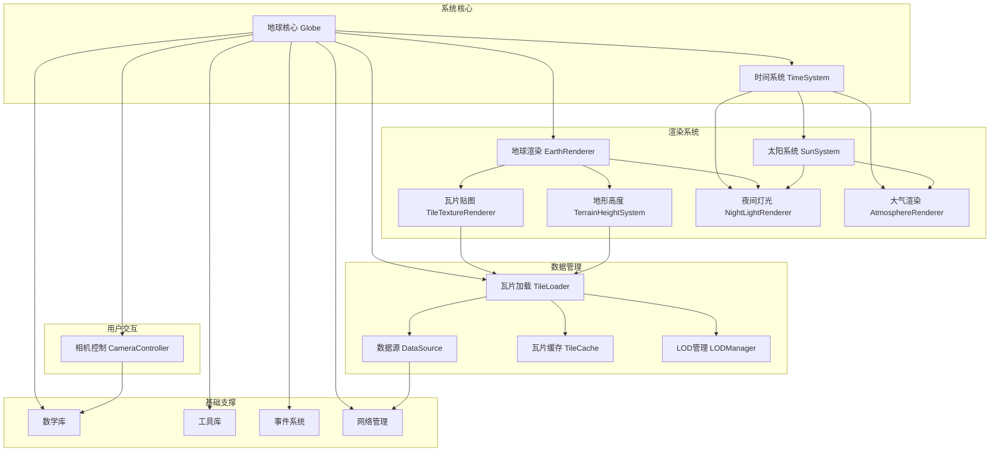
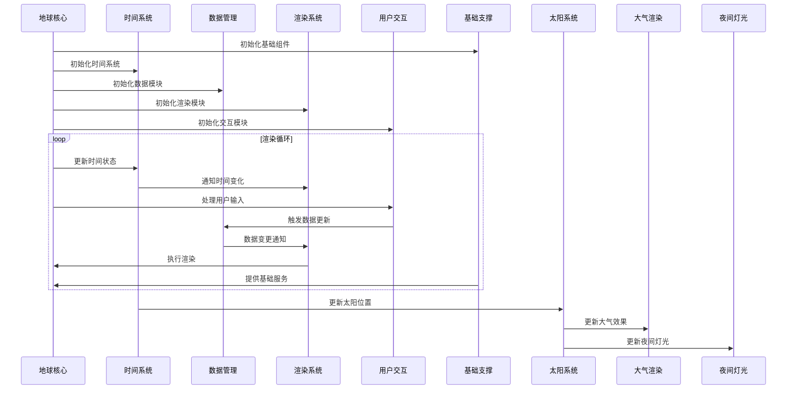

# OpenEarth 技术设计方案

## 项目概述

### 项目背景

OpenEarth 是一个现代化的 3D 地球可视化库，旨在提供高性能、可扩展的地理数据可视化解决方案。项目采用敏捷开发模式，通过迭代式开发逐步完善功能模块。

### 项目目标

- **核心目标**: 实现生产级稳定的地球瓦片数据加载和可视化功能
- **功能目标**: 提供标准化的 3D 地球交互体验
- **性能目标**: 支持大规模地理数据的高效渲染和交互

## 架构设计

### 整体技术架构

### 功能模块关系表

| 功能     | 模块     | 子模块       | 子模块描述                                       |
| -------- | -------- | ------------ | ------------------------------------------------ |
| 系统核心 | 地球核心 | 系统初始化   | 系统启动和模块初始化管理                         |
|          |          | 生命周期管理 | 系统运行状态和资源生命周期控制                   |
|          |          | 配置管理     | 系统参数配置和动态调整                           |
|          |          | 时间系统管理 | 全局时间管理和时间事件分发                       |
|          | 时间系统 | 时间管理     | 管理系统当前时间和日期                           |
|          |          | 时间缩放     | 控制时间流逝速度                                 |
|          |          | 时间同步     | 确保所有模块使用统一时间数据                     |
|          |          | 事件通知     | 向其他模块广播时间变化事件                       |
| 基础支撑 | 数学库   | 向量运算     | 3D向量计算和几何运算                             |
|          |          | 矩阵运算     | 变换矩阵计算和运算                               |
|          |          | 坐标转换     | 地理坐标系转换和投影计算                         |
|          | 工具库   | 日志系统     | 系统日志记录和输出管理                           |
|          |          | 错误处理     | 异常捕获和错误恢复机制                           |
|          |          | 性能监控     | 性能指标收集和分析                               |
|          | 事件系统 | 事件总线     | 模块间事件发布和订阅                             |
|          |          | 状态管理     | 系统状态同步和状态变更通知                       |
|          | 网络管理 | 请求管理     | 网络请求调度和连接管理                           |
|          |          | 重试机制     | 请求失败重试和错误恢复                           |
| 数据管理 | 瓦片加载 | 加载器       | 地理瓦片数据的异步加载处理                       |
|          |          | 队列管理     | 加载任务队列和优先级调度                         |
|          |          | 优先级控制   | 加载任务优先级和资源分配                         |
|          | 数据源   | 服务接口     | 外部瓦片服务接口封装                             |
|          |          | 协议适配     | 不同瓦片服务协议适配                             |
|          | 瓦片缓存 | LRU缓存      | 基于LRU策略的智能缓存                            |
|          |          | 内存管理     | 缓存内存使用和清理策略                           |
|          | LOD管理  | 级别计算     | 细节级别动态计算和调整                           |
|          |          | 切换控制     | LOD级别平滑切换控制                              |
| 渲染系统 | 地球渲染 | 模块协调     | 整合瓦片贴图、地形高度和夜间灯光                 |
|          |          | 渲染整合     | 将三个渲染效果整合到最终结果                     |
|          |          | 功能控制     | 提供三个功能的独立开关控制                       |
|          |          | 统一接口     | 为上层调用者提供统一API接口                      |
|          | 瓦片贴图 | 纹理转换     | 将图像瓦片数据转换为纹理对象                     |
|          |          | 贴图渲染     | 将瓦片纹理应用到地球表面                         |
|          |          | 纹理管理     | 管理瓦片纹理的创建、更新和销毁                   |
|          |          | 纹理拼接     | 处理瓦片间的无缝拼接                             |
|          | 地形高度 | 高度图处理   | 处理terrain-rgb格式的高度图瓦片                  |
|          |          | 地形网格生成 | 基于高程数据生成3D地形网格                       |
|          |          | 法线计算     | 自动计算地形网格的法线向量                       |
|          |          | 高度查询     | 提供任意位置的地形高度查询                       |
|          | 夜间灯光 | 灯光渲染     | 基于灰度纹理渲染城市灯光效果                     |
|          |          | 昼夜过渡     | 根据太阳位置计算昼夜过渡效果                     |
|          |          | 距离控制     | 根据相机距离控制灯光特效显示                     |
|          |          | 纹理管理     | 管理夜间灯光纹理的加载和应用                     |
|          | 大气渲染 | 散射计算     | 实现瑞利散射和米散射的物理计算                   |
|          |          | 大气球体     | 渲染地球周围的大气球体效果                       |
|          |          | 大气光晕     | 渲染大气层的光晕效果                             |
|          |          | 时间同步     | 响应时间变化，更新大气效果                       |
|          | 太阳系统 | 位置计算     | 基于儒略日计算的天文算法，支持精确的太阳位置计算 |
|          |          | 光照强度     | 计算太阳光照强度和颜色温度                       |
|          |          | 太阳圆盘     | 渲染太阳的视觉效果                               |
|          |          | 光照数据     | 为其他模块提供光照方向和强度                     |
| 用户交互 | 相机控制 | 旋转控制     | 相机旋转和视角控制                               |
|          |          | 缩放控制     | 相机缩放和距离控制                               |
|          |          | 平移控制     | 相机平移和位置控制                               |
|          |          | 碰撞检测     | 地形碰撞检测和限制                               |
|          |          | 飞行动画     | 相机飞行动画和路径控制                           |
|          |          | 约束管理     | 管理相机的移动范围和视角限制                     |
|          |          | 输入处理     | 鼠标、键盘、触摸和滚轮交互处理                   |

### 系统运行流程

## 技术选型

### 核心技术栈

- **3D 引擎**: Babylon.js 8.x
- **开发语言**: TypeScript 5.x
- **构建工具**: Vite 5.x
- **测试框架**: Vitest
- **代码规范**: ESLint + Prettier

### 模块技术选择

- **系统核心**: 基于 Babylon.js Engine 和 Scene 的架构设计，采用依赖注入模式协调各子模块
- **时间系统**: 基于 JavaScript Date 对象和 UTC 时间标准，使用 Babylon.js Observable 实现事件通知
- **基础支撑**: 自定义数学库、工具库、事件系统和网络管理
- **数据管理**: 异步瓦片加载、LRU缓存策略，支持多种瓦片服务协议（包括图像瓦片和高度图瓦片）
- **渲染系统**:
  - 地球渲染：基于依赖注入的协调架构，整合多个渲染效果
  - 瓦片贴图：基于 Babylon.js Texture 和 ShaderMaterial，处理图像瓦片数据
  - 地形高度：基于 Babylon.js Mesh 和 VertexData，处理terrain-rgb高度图瓦片数据
  - 夜间灯光：基于纹理映射的简单架构，使用自定义着色器
  - 大气渲染：基于物理的大气散射算法，使用 GLSL 着色器
  - 太阳系统：基于儒略日计算的天文算法，支持精确的太阳位置计算
- **用户交互**: 基于 Babylon.js ArcRotateCamera，支持基础的鼠标、滚轮和键盘交互，集成动画系统和碰撞检测
