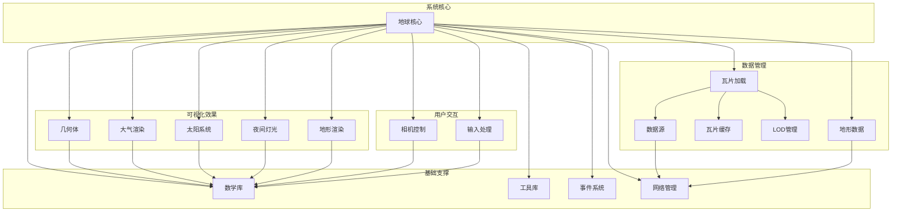
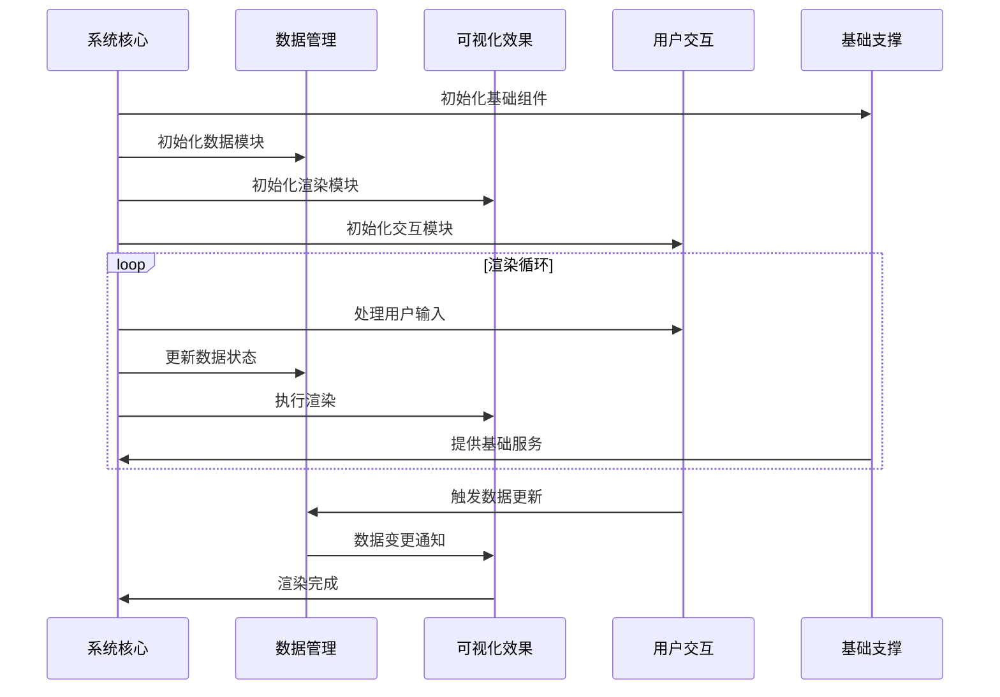

# OpenEarth 技术设计方案

## 项目概述

### 项目背景

OpenEarth 是一个现代化的 3D 地球可视化库，旨在提供高性能、可扩展的地理数据可视化解决方案。项目采用敏捷开发模式，通过迭代式开发逐步完善功能模块。

### 项目目标

- **核心目标**: 实现生产级稳定的地球瓦片数据加载和可视化功能
- **功能目标**: 提供标准化的 3D 地球交互体验
- **性能目标**: 支持大规模地理数据的高效渲染和交互

## 架构设计

### 整体技术架构

### 功能模块关系表

| 功能       | 模块     | 子模块       | 子模块描述                     |
| ---------- | -------- | ------------ | ------------------------------ |
| 系统核心   | 地球核心 | 系统初始化   | 系统启动和模块初始化管理       |
|            |          | 生命周期管理 | 系统运行状态和资源生命周期控制 |
|            |          | 配置管理     | 系统参数配置和动态调整         |
| 基础支撑   | 数学库   | 向量运算     | 3D向量计算和几何运算           |
|            |          | 矩阵运算     | 变换矩阵计算和运算             |
|            |          | 坐标转换     | 地理坐标系转换和投影计算       |
|            | 工具库   | 日志系统     | 系统日志记录和输出管理         |
|            |          | 错误处理     | 异常捕获和错误恢复机制         |
|            |          | 性能监控     | 性能指标收集和分析             |
|            | 事件系统 | 事件总线     | 模块间事件发布和订阅           |
|            |          | 状态管理     | 系统状态同步和状态变更通知     |
|            | 网络管理 | 请求管理     | 网络请求调度和连接管理         |
|            |          | 重试机制     | 请求失败重试和错误恢复         |
| 数据管理   | 瓦片加载 | 加载器       | 地理瓦片数据的异步加载处理     |
|            |          | 队列管理     | 加载任务队列和优先级调度       |
|            |          | 优先级控制   | 加载任务优先级和资源分配       |
|            | 数据源   | 服务接口     | 外部瓦片服务接口封装           |
|            |          | 协议适配     | 不同瓦片服务协议适配           |
|            | 瓦片缓存 | LRU缓存      | 基于LRU策略的智能缓存          |
|            |          | 内存管理     | 缓存内存使用和清理策略         |
|            | LOD管理  | 级别计算     | 细节级别动态计算和调整         |
|            |          | 切换控制     | LOD级别平滑切换控制            |
|            | 地形数据 | 地形加载     | 地形高程数据的加载处理         |
|            |          | 地形缓存     | 地形数据缓存和存储管理         |
|            |          | 地形LOD      | 地形细节级别动态调整           |
| 可视化效果 | 几何体   | 球体生成     | 3D地球球体几何生成             |
|            |          | 网格优化     | 几何网格优化和简化             |
|            |          | 法线计算     | 表面法线计算和优化             |
|            | 大气渲染 | 散射计算     | 大气散射效果计算               |
|            |          | 后处理       | 大气效果后处理渲染             |
|            |          | 查找纹理     | 大气查找纹理生成               |
|            | 太阳系统 | 位置计算     | 太阳位置和光照角度计算         |
|            |          | 光照模拟     | 太阳光照效果模拟               |
|            |          | 时钟同步     | 时间同步和日期处理             |
|            | 夜间灯光 | 灯光渲染     | 夜间城市灯光效果渲染           |
|            |          | 数据映射     | 灯光数据映射和可视化           |
|            |          | 系数控制     | 夜间灯光强度系数控制           |
|            | 地形渲染 | 地形网格     | 地形网格生成和渲染             |
|            |          | 地形材质     | 地形材质应用和纹理管理         |
|            |          | 高程映射     | 地形高程数据映射               |
| 用户交互   | 相机控制 | 旋转控制     | 相机旋转和视角控制             |
|            |          | 缩放控制     | 相机缩放和距离控制             |
|            |          | 平移控制     | 相机平移和位置控制             |
|            |          | 碰撞检测     | 地形碰撞检测和限制             |
|            |          | 飞行动画     | 相机飞行动画和路径控制         |
|            |          | 过渡效果     | 视角切换过渡效果               |
|            |          | 缓动函数     | 动画缓动和插值函数             |
|            | 输入处理 | 鼠标控制     | 鼠标交互事件处理               |
|            |          | 键盘控制     | 键盘快捷键和操作处理           |

### 系统运行流程

## 技术选型

### 核心技术栈

- **3D 引擎**: Babylon.js 8.x
- **开发语言**: TypeScript 5.x
- **构建工具**: Vite 5.x
- **测试框架**: Vitest
- **代码规范**: ESLint + Prettier

### 模块技术选择

- **系统核心**: 基于 Babylon.js Engine 和 Scene 的架构设计
- **基础支撑**: 自定义数学库、工具库、事件系统和网络管理
- **数据管理**: 异步瓦片加载、LRU缓存策略、LOD管理、地形数据处理
- **可视化效果**: 几何体生成、大气散射、太阳光照、夜间灯光、地形渲染
- **用户交互**: 相机控制、鼠标键盘输入处理
