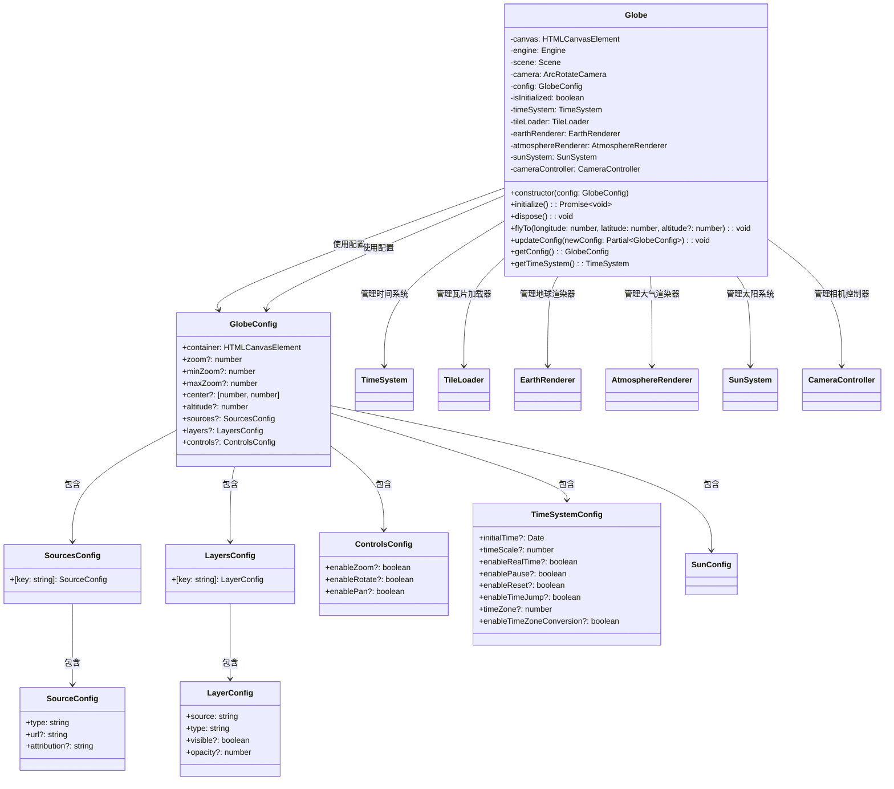
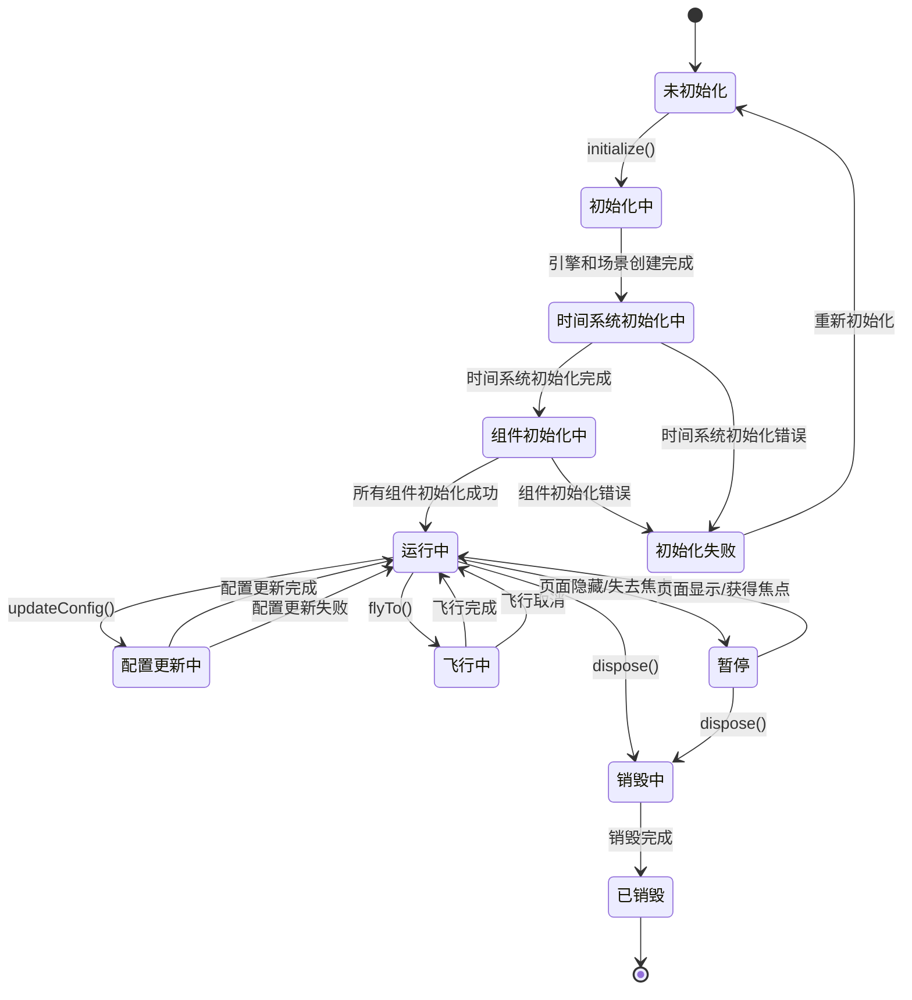
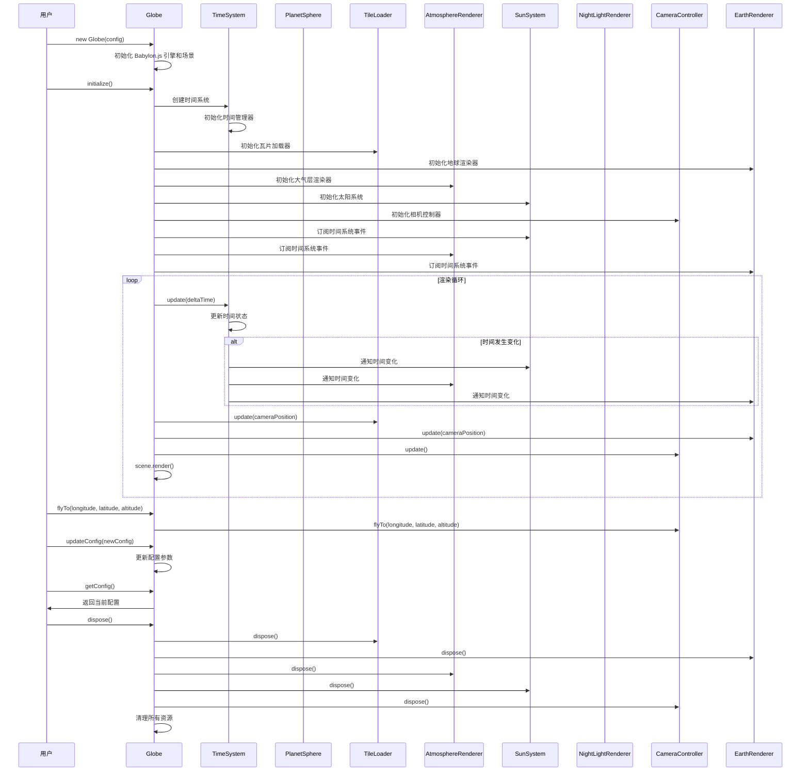

# 地球核心模块设计

## 模块概述

地球核心模块是 OpenEarth 系统的核心控制器，负责系统的统一入口、生命周期管理、配置管理和时间系统管理。作为系统的中枢，它协调各个功能模块的工作，确保系统的稳定运行。

该模块基于 Babylon.js 引擎的 Scene 和 Engine 架构设计，通过 Engine 实例管理 WebGL 上下文和渲染设备，通过 Scene 实例管理 3D 场景中的所有对象和渲染状态。模块采用观察者模式，使用 Babylon.js 的 Observable 系统实现模块间的事件通信，通过 Scene.registerBeforeRender() 注册渲染循环回调，确保各模块在每帧渲染前完成状态更新。时间系统管理采用全局时间管理器模式，通过 TimeSystem 模块统一管理系统时间，向所有需要时间信息的模块广播时间变化事件，实现时间同步和协调。配置管理采用深度合并策略，支持运行时动态配置更新，通过 TypeScript 的泛型和接口约束确保配置类型安全。生命周期管理遵循标准的初始化-运行-销毁模式，在初始化阶段按依赖关系顺序创建各子模块（优先创建时间系统，然后创建依赖时间的模块），在销毁阶段按相反顺序清理资源，确保无内存泄漏。错误处理采用统一的异常捕获机制，通过自定义错误类型和错误码实现精确的错误定位和恢复策略。

## 模块职责

- **系统初始化**：系统启动和模块初始化管理
- **生命周期管理**：系统运行状态和资源生命周期控制
- **配置管理**：系统参数配置和动态调整
- **时间系统管理**：全局时间管理和时间事件分发

## 类图设计

## 状态图设计

## 序列图设计

