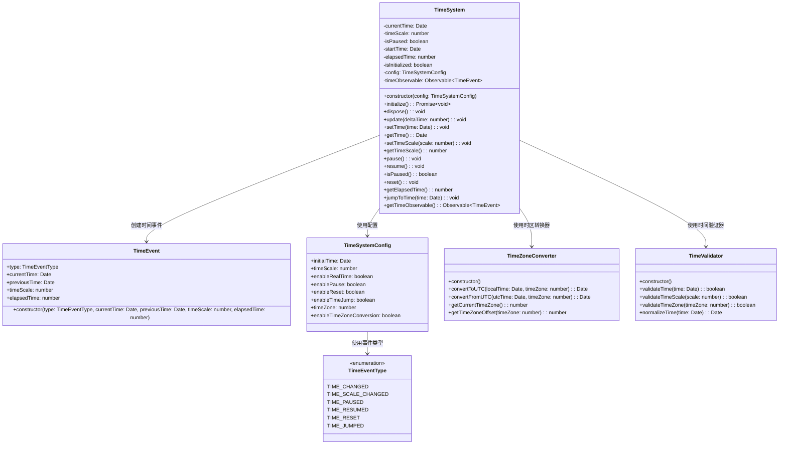
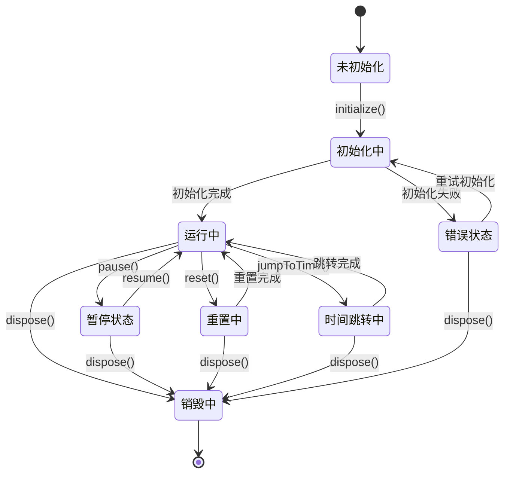
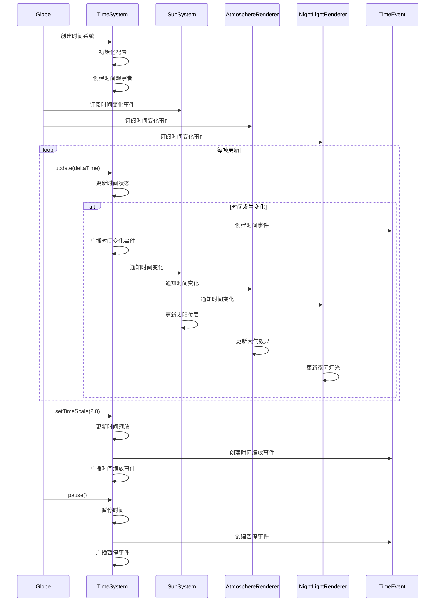

# 时间系统模块设计

## 模块概述

时间系统模块是 OpenEarth 系统的全局时间管理核心，负责统一管理系统时间、时间缩放和时间同步。该模块基于 JavaScript Date 对象和 UTC 时间标准，为太阳系统、大气渲染、夜间灯光等模块提供统一的时间数据，支持时间加速、减速、暂停和重置等时间控制功能。

该模块采用基于事件驱动的时间管理架构，通过 Babylon.js 的 Observable 系统实现时间变化的全局通知机制。时间管理使用 JavaScript Date 对象作为基础时间单位，通过 UTC 时间标准确保全球时间一致性，支持时区转换和本地时间显示。时间缩放通过时间缩放因子实现时间加速或减速效果，支持模拟不同时间段的快速变化，如昼夜循环、季节变化等。时间控制提供暂停、恢复、重置和跳转功能，允许用户灵活控制时间流逝，支持时间回放和快进操作。事件通知采用观察者模式，当时间发生变化时自动通知所有注册的模块，包括太阳系统、大气渲染、夜间灯光等，实现模块间的松耦合通信。性能优化采用事件节流和批量通知技术，避免频繁的时间更新通知，通过时间缓存和增量更新减少计算开销。

## 模块职责

- **时间管理**：管理系统当前时间和日期，支持时间设置和获取
- **时间缩放**：控制时间流逝速度，支持时间加速、减速和暂停
- **时间同步**：确保所有模块使用统一的时间数据
- **事件通知**：向其他模块广播时间变化事件
- **时区处理**：支持时区转换和本地时间显示
- **时间控制**：提供时间跳转、重置等控制功能

## 类图设计

## 状态图设计

## 时序图设计

## 配置参数

### TimeSystemConfig

| 参数                     | 类型    | 默认值     | 说明             |
| ------------------------ | ------- | ---------- | ---------------- |
| initialTime              | Date    | new Date() | 初始时间         |
| timeScale                | number  | 1.0        | 时间缩放因子     |
| enableRealTime           | boolean | true       | 是否启用实时模式 |
| enablePause              | boolean | true       | 是否启用暂停功能 |
| enableReset              | boolean | true       | 是否启用重置功能 |
| enableTimeJump           | boolean | true       | 是否启用时间跳转 |
| timeZone                 | number  | 0          | 时区偏移（小时） |
| enableTimeZoneConversion | boolean | false      | 是否启用时区转换 |

### TimeEventType

| 事件类型           | 说明             |
| ------------------ | ---------------- |
| TIME_CHANGED       | 时间发生变化     |
| TIME_SCALE_CHANGED | 时间缩放发生变化 |
| TIME_PAUSED        | 时间暂停         |
| TIME_RESUMED       | 时间恢复         |
| TIME_RESET         | 时间重置         |
| TIME_JUMPED        | 时间跳转         |

## 性能优化

### 事件节流

- 使用事件节流技术避免频繁的时间更新通知
- 设置最小时间间隔，减少不必要的事件广播

### 时间缓存

- 缓存常用的时间计算结果
- 使用增量更新减少重复计算

### 批量通知

- 批量处理时间变化事件
- 减少模块间的通信开销

## 错误处理

### 时间验证

- 验证时间格式和范围
- 处理无效的时间输入

### 异常恢复

- 时间系统异常时的自动恢复机制
- 提供时间同步和校准功能

### 错误日志

- 记录时间管理相关的错误信息
- 提供详细的错误诊断信息
