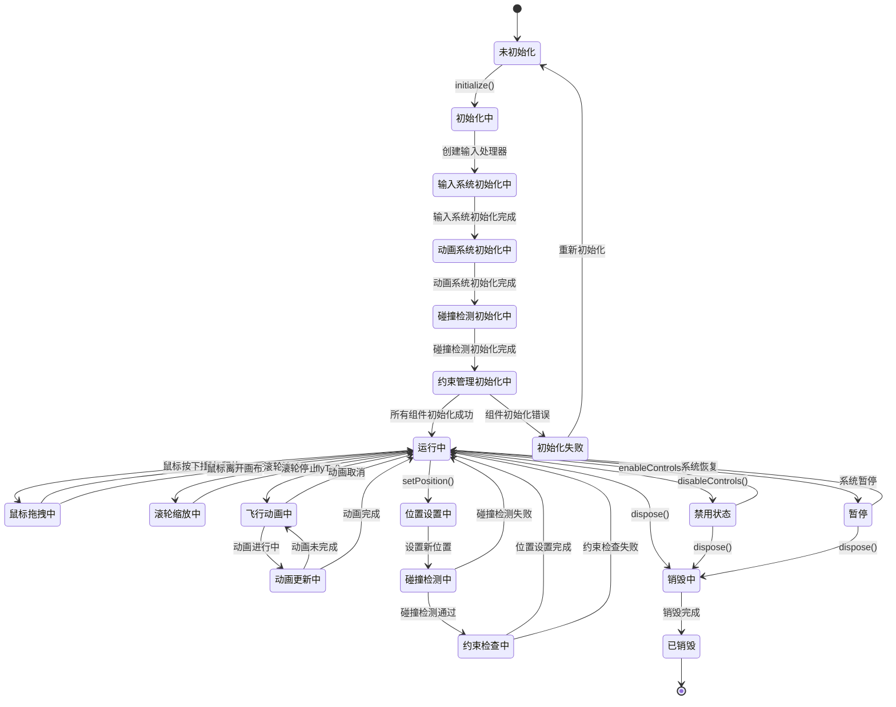
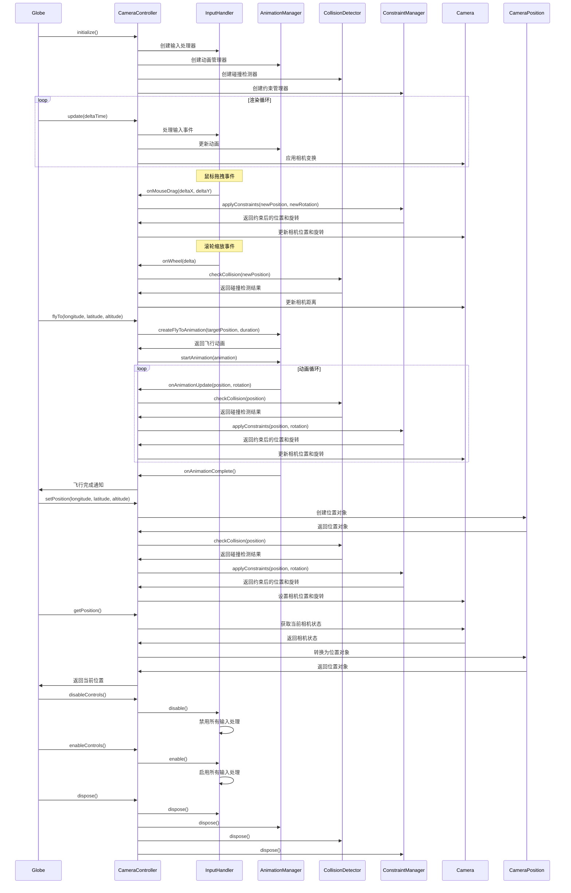

# 相机控制模块设计

## 模块概述

相机控制模块是 OpenEarth 系统的用户交互核心，负责提供直观、流畅的 3D 地球浏览体验。该模块集成了相机控制、输入处理和动画系统功能，为用户提供基础的交互方式，包括鼠标控制、滚轮缩放和程序化飞行动画。

该模块基于 Babylon.js 的 ArcRotateCamera 架构设计，通过 ArcRotateCamera 实现围绕地球的轨道控制，支持旋转、缩放、平移等基础操作。输入处理采用简化的统一处理器，通过 Scene.onPointerObservable 和 Scene.onKeyboardObservable 监听用户输入事件，使用事件委托模式统一处理鼠标、滚轮和键盘输入。动画系统基于 Babylon.js 的 Animation 框架，通过 EasingFunction 实现平滑的缓动效果，支持基础的飞行动画。碰撞检测使用简单的球面几何计算，通过计算相机位置与地球中心的距离判断是否发生碰撞，当检测到碰撞时自动调整相机到最近的有效位置。约束管理通过简单的数学函数限制相机的移动范围，包括距离约束和视角约束，确保相机始终保持在合理的观察范围内。

## 模块职责

- **相机控制**：提供旋转、缩放、平移等基础相机操作
- **输入处理**：处理鼠标、滚轮、键盘等用户输入事件
- **动画系统**：实现飞行动画和过渡效果
- **碰撞检测**：确保相机不会穿透地球表面
- **约束管理**：管理相机的移动范围和视角限制

## 类图设计

```mermaid
classDiagram
    class CameraController {
        -camera: ArcRotateCamera
        -inputHandler: InputHandler
        -animationManager: AnimationManager
        -collisionDetector: CollisionDetector
        -constraintManager: ConstraintManager
        -isInitialized: boolean
        -isAnimating: boolean
        +constructor(camera: ArcRotateCamera, config: CameraControllerConfig)
        +initialize(): Promise~void~
        +dispose(): void
        +flyTo(longitude: number, latitude: number, altitude?: number): Promise~void~
        +setPosition(longitude: number, latitude: number, altitude: number): void
        +getPosition(): CameraPosition
        +enableControls(): void
        +disableControls(): void
        +update(deltaTime: number): void
    }

    class InputHandler {
        -canvas: HTMLCanvasElement
        -isEnabled: boolean
        -sensitivity: number
        +constructor(canvas: HTMLCanvasElement, config: InputConfig)
        +initialize(): void
        +dispose(): void
        +enable(): void
        +disable(): void
        +handleMouse(event: MouseEvent): void
        +handleWheel(event: WheelEvent): void
        +handleKeyboard(event: KeyboardEvent): void
    }

    class AnimationManager {
        -activeAnimation: Animation | null
        +constructor()
        +createFlyToAnimation(target: CameraPosition, duration: number): Animation
        +startAnimation(animation: Animation): void
        +stopAnimation(): void
        +update(deltaTime: number): void
        +isAnimating(): boolean
    }

    class Animation {
        -id: string
        -type: AnimationType
        -startValue: any
        -endValue: any
        -duration: number
        -elapsedTime: number
        -easingFunction: EasingFunction
        -onUpdate: AnimationCallback
        -onComplete: AnimationCallback
        -isCompleted: boolean
        +constructor(config: AnimationConfig)
        +update(deltaTime: number): void
        +isCompleted(): boolean
        +getProgress(): number
        +dispose(): void
    }

    class CollisionDetector {
        -earthRadius: number
        -minAltitude: number
        -maxAltitude: number
        +constructor(config: CollisionConfig)
        +checkCollision(position: Vector3): boolean
        +getClosestValidPosition(position: Vector3): Vector3
        +setEarthRadius(radius: number): void
        +setAltitudeLimits(min: number, max: number): void
    }

    class ConstraintManager {
        -minDistance: number
        -maxDistance: number
        -minPolarAngle: number
        -maxPolarAngle: number
        +constructor(config: ConstraintConfig)
        +applyConstraints(position: Vector3, rotation: Vector3): ConstraintResult
        +setDistanceLimits(min: number, max: number): void
        +setPolarAngleLimits(min: number, max: number): void
        +isWithinConstraints(position: Vector3, rotation: Vector3): boolean
    }

    class CameraPosition {
        +longitude: number
        +latitude: number
        +altitude: number
        +heading: number
        +pitch: number
        +roll: number
        +constructor(longitude: number, latitude: number, altitude: number)
        +toVector3(): Vector3
        +fromVector3(vector: Vector3): CameraPosition
        +clone(): CameraPosition
        +equals(other: CameraPosition): boolean
    }

    class Vector3 {
        +x: number
        +y: number
        +z: number
        +constructor(x: number, y: number, z: number)
        +clone(): Vector3
        +add(other: Vector3): Vector3
        +subtract(other: Vector3): Vector3
        +multiply(scalar: number): Vector3
        +dot(other: Vector3): number
        +cross(other: Vector3): Vector3
        +magnitude(): number
        +normalize(): Vector3
    }

    class CameraControllerConfig {
        +enableMouse: boolean
        +enableKeyboard: boolean
        +enableWheel: boolean
        +sensitivity: number
        +constraints: ConstraintConfig
        +collision: CollisionConfig
        +animation: AnimationConfig
    }

    class InputConfig {
        +sensitivity: number
        +enableDrag: boolean
        +enableWheel: boolean
        +enableKeyboard: boolean
    }

    class ConstraintConfig {
        +minDistance: number
        +maxDistance: number
        +minPolarAngle: number
        +maxPolarAngle: number
    }

    class CollisionConfig {
        +earthRadius: number
        +minAltitude: number
        +maxAltitude: number
    }

    class AnimationConfig {
        +defaultDuration: number
        +easingFunction: string
    }

    class ConstraintResult {
        +position: Vector3
        +rotation: Vector3
        +isConstrained: boolean
        +constraintType: string
    }

    class AnimationType {
        <<enumeration>>
        FLY_TO
        ROTATION
        ZOOM
    }

    CameraController --> InputHandler : 使用输入处理器
    CameraController --> AnimationManager : 使用动画管理器
    CameraController --> CollisionDetector : 使用碰撞检测器
    CameraController --> ConstraintManager : 使用约束管理器
    CameraController --> CameraControllerConfig : 使用配置

    InputHandler --> InputConfig : 使用配置

    AnimationManager --> Animation : 管理动画
    Animation --> AnimationType : 使用动画类型

    CollisionDetector --> Vector3 : 使用三维向量
    ConstraintManager --> Vector3 : 使用三维向量
    ConstraintManager --> ConstraintResult : 返回约束结果

    CameraPosition --> Vector3 : 转换为三维向量
```

## 状态图设计

## 序列图设计

## 核心算法设计

### 相机位置计算算法

相机位置计算算法负责经纬度坐标与3D空间坐标之间的转换。算法将地理坐标系的经纬度转换为笛卡尔坐标系的三维坐标，同时支持反向转换。转换过程考虑地球半径和相机高度，确保坐标转换的准确性。

### 飞行动画算法

飞行动画算法实现相机在不同位置之间的平滑过渡。采用球面线性插值技术确保飞行路径的平滑性，避免直线插值可能导致的穿越地球问题。算法支持基础的缓动函数，提供平滑的动画效果。

### 碰撞检测算法

碰撞检测算法确保相机不会穿透地球表面。通过计算相机位置与地球中心的距离，判断是否低于最小允许高度。当检测到碰撞时，算法会自动调整相机位置到最近的有效位置。

### 约束管理算法

约束管理算法限制相机的移动范围和视角。包括距离约束和极角约束，确保相机始终保持在合理的观察范围内。算法会实时检查并修正超出约束范围的相机状态。

## 配置参数

### CameraControllerConfig

| 参数           | 类型             | 默认值 | 说明             |
| -------------- | ---------------- | ------ | ---------------- |
| enableMouse    | boolean          | true   | 是否启用鼠标控制 |
| enableKeyboard | boolean          | true   | 是否启用键盘控制 |
| enableWheel    | boolean          | true   | 是否启用滚轮控制 |
| sensitivity    | number           | 1.0    | 输入灵敏度       |
| constraints    | ConstraintConfig | -      | 约束配置         |
| collision      | CollisionConfig  | -      | 碰撞检测配置     |
| animation      | AnimationConfig  | -      | 动画配置         |

### InputConfig

| 参数           | 类型    | 默认值 | 说明         |
| -------------- | ------- | ------ | ------------ |
| sensitivity    | number  | 1.0    | 输入灵敏度   |
| enableDrag     | boolean | true   | 是否启用拖拽 |
| enableWheel    | boolean | true   | 是否启用滚轮 |
| enableKeyboard | boolean | true   | 是否启用键盘 |

### ConstraintConfig

| 参数          | 类型   | 默认值 | 说明     |
| ------------- | ------ | ------ | -------- |
| minDistance   | number | 1.2    | 最小距离 |
| maxDistance   | number | 10.0   | 最大距离 |
| minPolarAngle | number | 0.1    | 最小极角 |
| maxPolarAngle | number | 3.04   | 最大极角 |

### CollisionConfig

| 参数        | 类型   | 默认值 | 说明     |
| ----------- | ------ | ------ | -------- |
| earthRadius | number | 1.0    | 地球半径 |
| minAltitude | number | 1.2    | 最小高度 |
| maxAltitude | number | 10.0   | 最大高度 |

### AnimationConfig

| 参数            | 类型   | 默认值 | 说明         |
| --------------- | ------ | ------ | ------------ |
| defaultDuration | number | 2000   | 默认动画时长 |
| easingFunction  | string | 'ease' | 缓动函数     |

## 性能优化

### 输入处理优化

- **事件节流**：限制输入事件的处理频率，避免过度计算
- **批量处理**：将多个输入事件批量处理，减少函数调用开销

### 动画优化

- **插值缓存**：缓存常用的插值计算结果
- **动画池**：重用动画对象，减少内存分配

### 碰撞检测优化

- **预计算**：预计算常用的碰撞检测结果
- **异步检测**：将复杂的碰撞检测放在后台线程

## 错误处理

### 输入错误处理

- **输入验证**：验证输入参数的有效性
- **异常恢复**：输入异常时自动恢复到安全状态
- **错误日志**：记录输入处理错误用于调试

### 动画错误处理

- **动画中断**：处理动画被意外中断的情况
- **参数验证**：验证动画参数的合理性
- **回退机制**：动画失败时提供回退方案

### 约束错误处理

- **约束冲突**：处理多个约束条件冲突的情况
- **边界处理**：处理约束边界值的情况
- **动态调整**：根据情况动态调整约束参数
