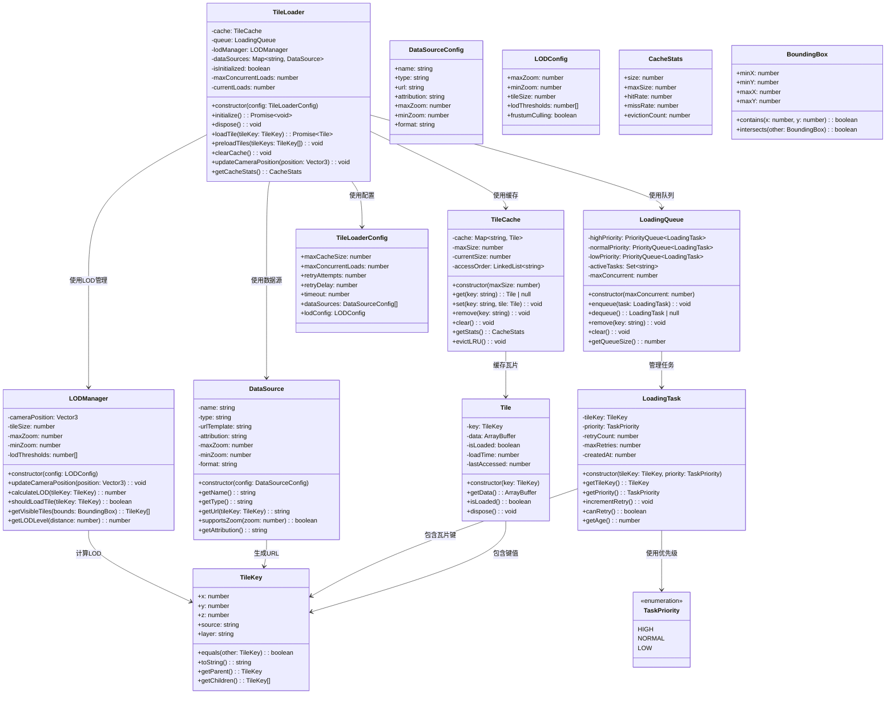
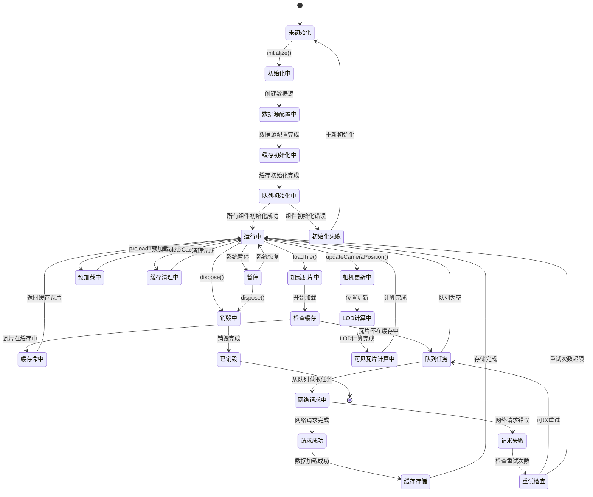
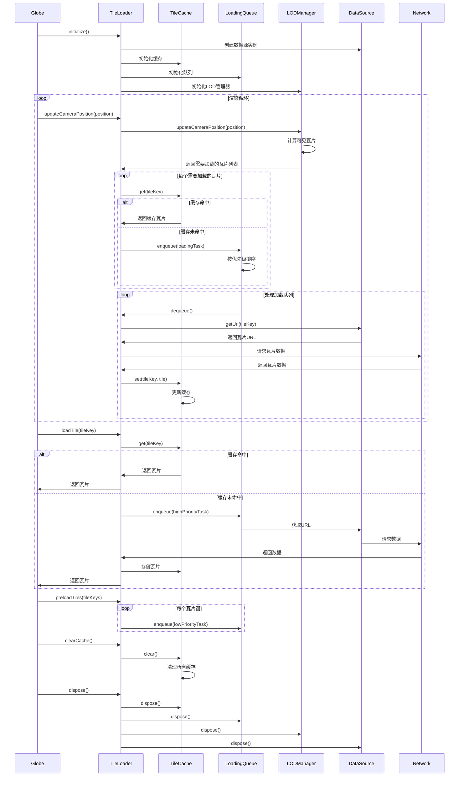

# 瓦片加载模块设计

## 模块概述

瓦片加载模块是 OpenEarth 系统的数据管理核心，负责地理瓦片数据的异步加载、缓存管理和 LOD（细节级别）控制。该模块专注于瓦片数据的获取和管理，为瓦片贴图模块提供数据支持，确保用户能够流畅地浏览不同缩放级别的地理信息。

该模块采用基于 Web Workers 的异步加载架构，通过 Worker 线程处理瓦片数据的下载和解码，避免阻塞主线程的渲染性能。缓存管理使用 LRU（最近最少使用）算法实现智能内存管理，通过 Map 数据结构存储瓦片数据，使用双向链表维护访问顺序，当缓存达到容量限制时自动淘汰最久未使用的瓦片。LOD 管理基于屏幕空间误差（Screen Space Error）算法，根据相机距离、瓦片大小和屏幕分辨率动态计算合适的细节级别，通过四叉树结构组织瓦片层次关系，实现平滑的 LOD 切换。网络请求采用 Fetch API 和 AbortController 实现可取消的异步请求，支持重试机制和超时控制，通过 Promise 和 async/await 语法简化异步流程。数据格式支持多种瓦片服务协议，包括 TMS、WMTS、XYZ 等标准协议，通过适配器模式统一不同数据源的接口。性能优化采用视锥剔除技术，只加载相机视野内的瓦片，通过空间索引和边界框检测快速筛选可见瓦片，减少不必要的网络请求和内存占用。

## 模块职责

- **瓦片数据加载**：异步加载地理瓦片数据，支持多种数据源和协议
- **缓存管理**：基于 LRU 策略的智能缓存，优化内存使用和加载性能
- **LOD 管理**：动态计算和调整细节级别，确保数据质量和加载性能平衡
- **队列管理**：加载任务队列和优先级调度，优化网络资源使用
- **数据源管理**：支持多种瓦片服务协议和数据格式
- **数据接口**：为瓦片贴图模块提供瓦片数据访问接口

## 类图设计



## 状态图设计



## 序列图设计



## 核心算法

### LOD 计算算法

```typescript
// LOD 级别计算
function calculateLOD(tileKey: TileKey, cameraPosition: Vector3): number {
    const tileCenter = getTileCenter(tileKey);
    const distance = Vector3.Distance(cameraPosition, tileCenter);
    const tileSize = getTileSize(tileKey.z);
    const screenSpaceError = (tileSize / distance) * screenHeight;
    
    // 根据屏幕空间误差计算合适的 LOD 级别
    for (let lod = 0; lod < lodThresholds.length; lod++) {
        if (screenSpaceError <= lodThresholds[lod]) {
            return lod;
        }
    }
    return lodThresholds.length - 1;
}
```

### LRU 缓存算法

```typescript
// LRU 缓存淘汰策略
function evictLRU(): void {
    if (currentSize <= maxSize) return;
    
    const toEvict = Math.ceil(currentSize * 0.1); // 淘汰 10%
    for (let i = 0; i < toEvict; i++) {
        const oldestKey = accessOrder.removeFirst();
        const tile = cache.get(oldestKey);
        if (tile) {
            tile.dispose();
            cache.delete(oldestKey);
            currentSize--;
        }
    }
}
```

### 优先级队列算法

```typescript
// 优先级任务调度
function scheduleTask(task: LoadingTask): void {
    switch (task.getPriority()) {
        case TaskPriority.HIGH:
            highPriority.enqueue(task);
            break;
        case TaskPriority.NORMAL:
            normalPriority.enqueue(task);
            break;
        case TaskPriority.LOW:
            lowPriority.enqueue(task);
            break;
    }
    
    processQueue();
}
```

## 性能优化策略

### 缓存策略
- **LRU 淘汰**：基于最近最少使用原则淘汰缓存
- **内存限制**：设置最大缓存大小，防止内存溢出
- **预加载**：根据相机移动方向预加载相邻瓦片

### 网络优化
- **并发控制**：限制同时进行的网络请求数量
- **重试机制**：网络失败时自动重试，支持指数退避
- **超时控制**：设置请求超时时间，避免长时间等待

### LOD 优化
- **视锥剔除**：只加载相机视野内的瓦片
- **距离计算**：根据相机距离动态调整瓦片精度
- **平滑过渡**：LOD 级别切换时的平滑过渡效果

## 错误处理

### 网络错误处理
- **重试机制**：网络请求失败时自动重试
- **降级策略**：高精度瓦片加载失败时使用低精度瓦片
- **错误日志**：记录详细的错误信息用于调试

### 内存管理
- **内存监控**：实时监控内存使用情况
- **自动清理**：内存不足时自动清理缓存
- **资源释放**：及时释放不再使用的纹理和缓冲区

### 数据验证
- **格式检查**：验证加载的瓦片数据格式
- **完整性检查**：确保瓦片数据完整无损
- **异常处理**：处理损坏或无效的瓦片数据
