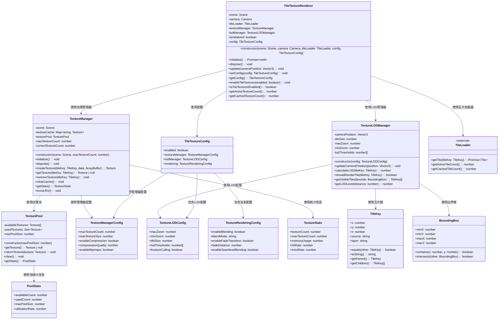
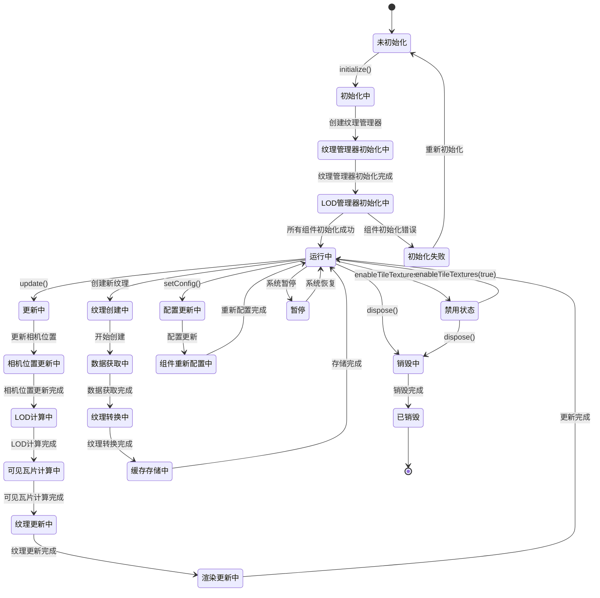
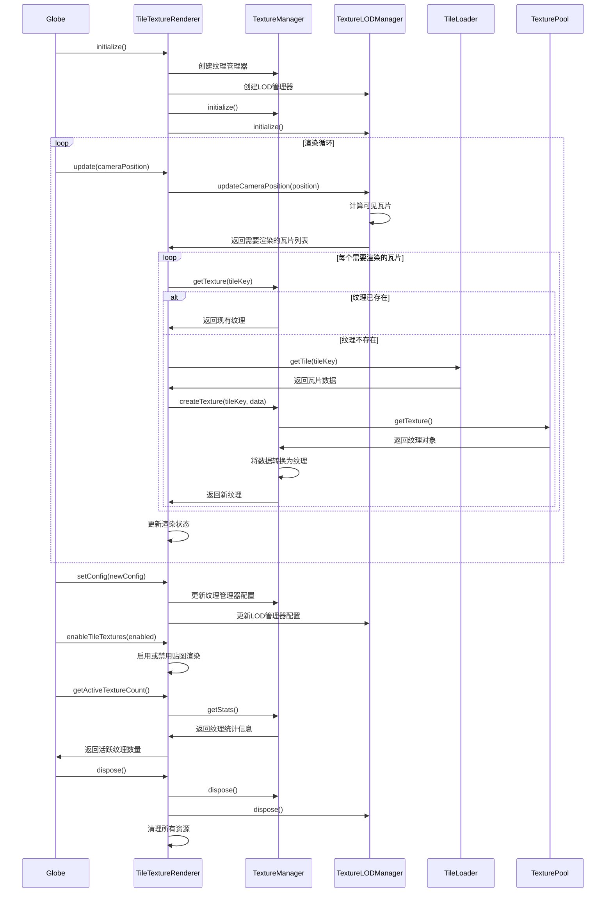

# 瓦片贴图模块设计

## 模块概述

瓦片贴图模块是 OpenEarth 系统的地表纹理渲染核心，负责将瓦片数据转换为地球表面的贴图效果。该模块专注于贴图渲染功能，从瓦片加载模块获取数据，将瓦片数据转换为纹理并应用到地球表面，为地球提供真实的地表外观。

该模块采用基于 Babylon.js 的 Texture 和 ShaderMaterial 架构设计，通过 TileTextureRenderer 实现贴图渲染的核心功能。瓦片数据处理从瓦片加载模块获取已加载的瓦片数据，将 ArrayBuffer 格式的瓦片数据转换为 Babylon.js 纹理对象，支持多种瓦片格式包括 PNG、JPG 等图像格式。纹理管理使用纹理池和缓存机制，管理多个瓦片的纹理对象，支持纹理的创建、更新和销毁，通过 LRU 策略优化纹理内存使用。贴图渲染使用自定义着色器技术，将多个瓦片纹理合成为连续的地表贴图，支持纹理坐标计算、纹理混合和边界处理，确保瓦片间的无缝拼接。LOD 管理根据相机距离动态调整贴图精度，通过四叉树结构组织不同精度的瓦片纹理，实现平滑的细节级别切换。性能优化采用视锥剔除、纹理压缩和批次渲染技术，只渲染可见区域的瓦片纹理，使用 GPU 纹理压缩减少内存占用，通过批次渲染减少绘制调用开销。

## 模块职责

- **瓦片纹理转换**：将瓦片数据转换为纹理对象
- **贴图渲染**：将瓦片纹理应用到地球表面
- **纹理管理**：管理瓦片纹理的创建、更新和销毁
- **LOD 管理**：实现多级细节的贴图渲染
- **纹理拼接**：处理瓦片间的无缝拼接
- **性能优化**：优化贴图渲染性能

## 类图设计

## 状态图设计

## 时序图设计

## 核心算法设计

### 瓦片纹理转换算法

瓦片纹理转换算法将瓦片数据转换为纹理对象。算法接收 ArrayBuffer 格式的瓦片数据，创建 Babylon.js 纹理对象，设置纹理参数包括格式、大小、压缩等，将纹理添加到场景中进行渲染。

### 纹理拼接算法

纹理拼接算法处理多个瓦片纹理的无缝拼接。算法计算每个瓦片的纹理坐标，处理瓦片边界处的混合，使用双线性插值确保瓦片间的平滑过渡，实现连续的地表贴图效果。

### LOD 纹理管理算法

LOD 纹理管理算法根据相机距离动态调整贴图精度。算法使用距离阈值和性能指标，自动选择合适精度的瓦片纹理，在保持视觉效果的同时优化渲染性能。

### 纹理缓存管理算法

纹理缓存管理算法使用 LRU 策略管理纹理内存。算法维护纹理访问顺序，当缓存达到容量限制时自动淘汰最久未使用的纹理，确保内存使用的合理性。

## 配置参数

### TileTextureConfig

| 参数 | 类型 | 默认值 | 说明 |
|------|------|--------|------|
| enabled | boolean | true | 是否启用瓦片贴图渲染 |
| textureManager | TextureManagerConfig | - | 纹理管理器配置 |
| lodManager | TextureLODConfig | - | LOD管理器配置 |
| rendering | TextureRenderingConfig | - | 渲染配置 |

### TextureManagerConfig

| 参数 | 类型 | 默认值 | 说明 |
|------|------|--------|------|
| maxTextureCount | number | 1000 | 最大纹理数量 |
| maxTextureSize | number | 512 | 最大纹理尺寸 |
| enableCompression | boolean | true | 是否启用纹理压缩 |
| compressionQuality | number | 0.8 | 压缩质量 |
| enableMipmaps | boolean | true | 是否启用Mipmap |

### TextureLODConfig

| 参数 | 类型 | 默认值 | 说明 |
|------|------|--------|------|
| maxZoom | number | 18 | 最大缩放级别 |
| minZoom | number | 0 | 最小缩放级别 |
| tileSize | number | 256 | 瓦片尺寸 |
| lodThresholds | number[] | [0.5, 1.0, 2.0, 4.0] | LOD阈值 |
| frustumCulling | boolean | true | 是否启用视锥剔除 |

### TextureRenderingConfig

| 参数 | 类型 | 默认值 | 说明 |
|------|------|--------|------|
| enableBlending | boolean | true | 是否启用纹理混合 |
| blendMode | string | 'alpha' | 混合模式 |
| enableFadeTransition | boolean | true | 是否启用淡入淡出 |
| fadeDistance | number | 0.2 | 淡入淡出距离 |
| enableSeamlessBlending | boolean | true | 是否启用无缝混合 |

## 性能优化

### 纹理优化
- **纹理压缩**：使用GPU纹理压缩减少内存占用
- **Mipmap生成**：自动生成多级纹理提高渲染质量
- **纹理池**：复用纹理对象减少创建开销
- **批次渲染**：合并多个纹理渲染调用

### 内存优化
- **LRU缓存**：基于最近最少使用原则管理纹理缓存
- **内存限制**：设置最大纹理数量防止内存溢出
- **智能清理**：自动清理不再使用的纹理
- **压缩存储**：压缩纹理数据减少存储空间

### 渲染优化
- **视锥剔除**：只渲染相机视野内的瓦片纹理
- **LOD系统**：根据距离动态调整纹理精度
- **异步加载**：后台加载纹理数据避免阻塞
- **预加载**：根据相机移动方向预加载相邻瓦片

### 计算优化
- **空间索引**：使用空间数据结构加速瓦片查找
- **预计算**：预计算常用的纹理坐标
- **近似算法**：使用近似算法简化复杂计算
- **多线程**：并行处理纹理数据

## 错误处理

### 纹理创建错误处理
- **数据格式错误**：处理无效的瓦片数据格式
- **纹理创建失败**：处理纹理对象创建异常
- **内存不足错误**：处理纹理创建内存不足
- **设备限制错误**：处理设备纹理能力限制

### 渲染错误处理
- **着色器编译错误**：处理贴图着色器编译失败
- **纹理绑定错误**：处理纹理绑定异常
- **渲染状态错误**：处理渲染状态异常
- **GPU错误**：处理GPU渲染错误

### 数据错误处理
- **瓦片数据错误**：处理瓦片数据加载失败
- **坐标计算错误**：处理纹理坐标计算异常
- **LOD计算错误**：处理LOD计算异常
- **缓存错误**：处理纹理缓存异常

### 系统错误处理
- **初始化错误**：处理系统初始化异常
- **配置错误**：处理配置参数验证错误
- **内存管理错误**：处理内存管理异常
- **性能监控错误**：处理性能监控异常
