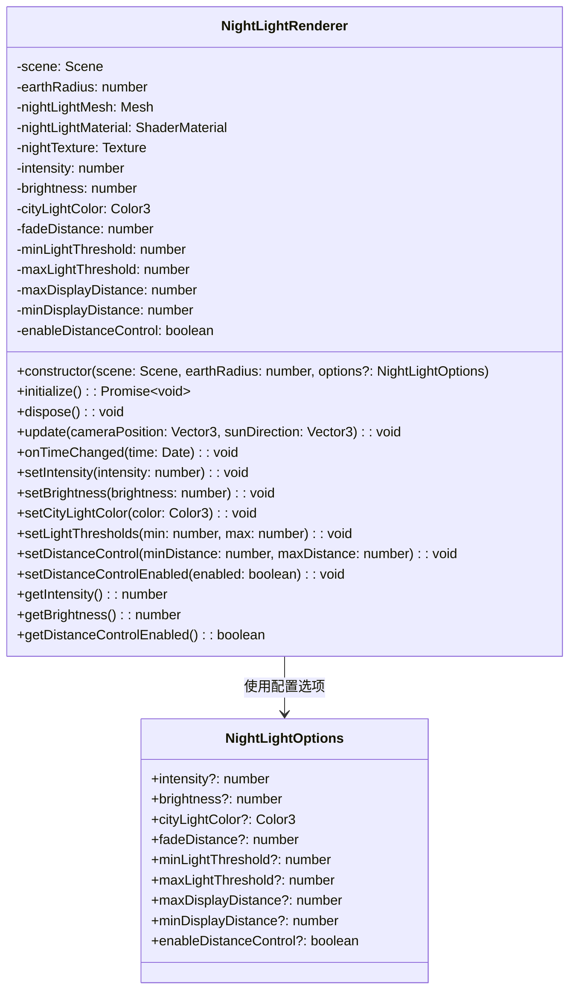
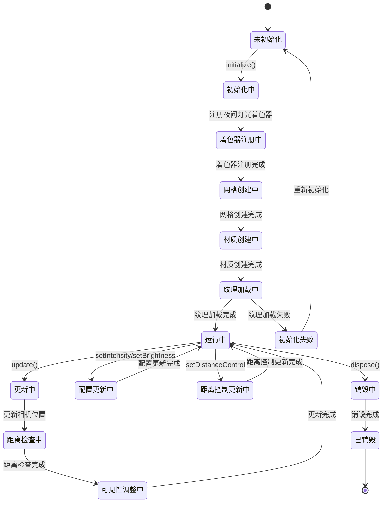
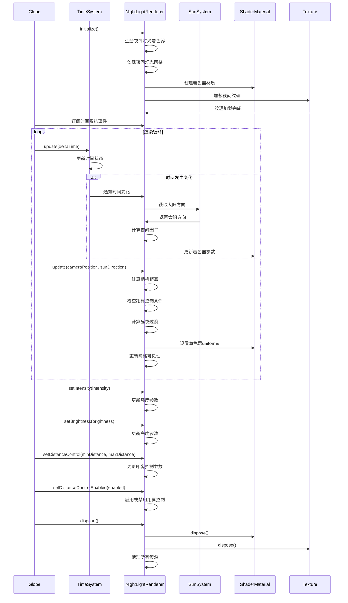

# 夜间灯光模块设计

## 模块概述

夜间灯光模块是 OpenEarth 系统的夜间视觉效果组件，负责渲染地球表面的城市灯光效果。该模块基于一张灰度纹理图实现夜间灯光的渲染，纹理中越亮的区域表示城市灯光越密集，通过太阳位置计算昼夜过渡效果，为地球提供真实的夜间外观。

该模块采用基于纹理映射的简单架构设计，通过内置的灰度纹理图（night.png）表示全球城市灯光的分布，纹理中白色区域表示灯光密集的城市区域，黑色区域表示无灯光的海洋和偏远地区。昼夜过渡通过太阳位置计算实现，当太阳在地平线以下时显示夜间灯光，当太阳升起时逐渐淡出灯光效果。距离控制根据相机距离动态调整夜间灯光特效的显示，当相机距离地球较远时显示夜间灯光，当相机推进到近距离时自动关闭特效，确保不影响瓦片纹理的可见性。着色器渲染使用 Babylon.js 的 ShaderMaterial，通过顶点着色器计算太阳方向和视角，片段着色器将纹理与城市灯光颜色混合，应用大气透视和光晕效果。时间同步通过订阅时间系统模块的时间变化事件，当接收到时间变化通知时自动更新太阳位置和夜间因子，确保夜间灯光与系统时间保持同步。性能优化采用简单的纹理采样和颜色混合，无需复杂的数据管理和缓存系统，通过 GPU 着色器实现高效的实时渲染。

## 模块职责

- **夜间灯光渲染**：基于灰度纹理渲染地球表面的城市灯光效果
- **昼夜过渡**：根据太阳位置计算昼夜过渡效果
- **距离控制**：根据相机距离控制夜间灯光特效的显示和隐藏
- **纹理管理**：管理夜间灯光纹理的加载和应用
- **着色器渲染**：实现夜间灯光的着色器渲染效果
- **时间同步**：响应时间变化，更新夜间灯光效果

## 类图设计

## 状态图设计

## 时序图设计

## 核心算法设计

### 夜间因子计算算法

夜间因子计算算法根据太阳位置确定夜间灯光的显示强度。算法通过计算太阳方向与地球表面法线的点积，当太阳在地平线以下时显示夜间灯光，当太阳升起时逐渐淡出灯光效果。使用平滑插值函数确保过渡效果自然流畅。

### 昼夜过渡算法

昼夜过渡算法实现平滑的昼夜切换效果。算法使用平滑插值函数，根据太阳角度计算夜间因子，确保夜间灯光的显示和隐藏过程自然流畅。当太阳角度在特定范围内时，夜间灯光会逐渐淡入或淡出。

### 大气透视算法

大气透视算法根据观察角度调整夜间灯光的亮度。算法通过计算观察方向与表面法线的夹角，实现距离相关的亮度衰减效果。当观察角度较小时，灯光亮度会相应降低，模拟大气透视效果。

### 距离控制算法

距离控制算法根据相机与地球的距离动态控制夜间灯光特效的显示。当相机距离过近时自动隐藏夜间灯光，确保瓦片纹理的可见性。算法计算相机到地球中心的距离，使用平滑插值函数在最小和最大显示距离之间进行过渡，最终可见性为夜间因子与距离因子的乘积。

## 着色器设计

### 顶点着色器

顶点着色器计算世界坐标、法线、UV坐标和太阳方向相关的参数，为片段着色器提供必要的数据。着色器接收位置、法线和UV坐标属性，以及世界变换矩阵、相机位置、太阳方向、地球半径和距离控制参数等uniform变量。主要计算包括世界坐标变换、法线变换、太阳方向点积和视角计算，为片段着色器提供渲染所需的所有插值数据。

### 片段着色器

片段着色器实现夜间灯光的最终渲染效果，包括纹理采样、颜色混合、光晕效果和大气透视。着色器接收夜间纹理、太阳方向、夜间因子、强度、亮度、城市灯光颜色、衰减距离、灯光阈值等uniform变量。主要处理包括采样夜间纹理、计算夜间强度、应用大气透视、混合城市灯光颜色、添加光晕效果，最终输出带有正确透明度的夜间灯光颜色。

## 配置参数

### NightLightOptions

| 参数                  | 类型    | 默认值          | 说明                         |
| --------------------- | ------- | --------------- | ---------------------------- |
| intensity             | number  | 1.0             | 夜间灯光强度                 |
| brightness            | number  | 0.8             | 夜间灯光亮度                 |
| cityLightColor        | Color3  | (1.0, 0.9, 0.6) | 城市灯光颜色                 |
| fadeDistance          | number  | 0.1             | 大气透视衰减距离             |
| minLightThreshold     | number  | 0.1             | 最小灯光阈值                 |
| maxLightThreshold     | number  | 0.9             | 最大灯光阈值                 |
| maxDisplayDistance    | number  | 2.0             | 最大显示距离（地球半径倍数） |
| minDisplayDistance    | number  | 1.2             | 最小显示距离（地球半径倍数） |
| enableDistanceControl | boolean | true            | 是否启用距离控制             |

## 性能优化

### 渲染优化

- **简单纹理采样**：使用单张纹理实现所有夜间灯光效果
- **GPU着色器**：所有计算在GPU中完成，无需CPU处理
- **最小绘制调用**：单个网格和材质实现完整效果

### 内存优化

- **纹理复用**：使用内置纹理，无需动态加载大量数据
- **无缓存需求**：静态纹理数据，无需复杂的缓存管理
- **最小内存占用**：简单的类结构，内存占用极小

## 错误处理

### 纹理加载错误处理

- **纹理加载失败**：提供程序化生成的备用纹理
- **纹理格式错误**：验证纹理格式和尺寸
- **网络错误**：处理纹理加载的网络异常

### 着色器错误处理

- **着色器编译失败**：提供错误日志和降级方案
- **uniform参数错误**：验证着色器参数的有效性
- **渲染状态异常**：处理渲染状态异常情况
