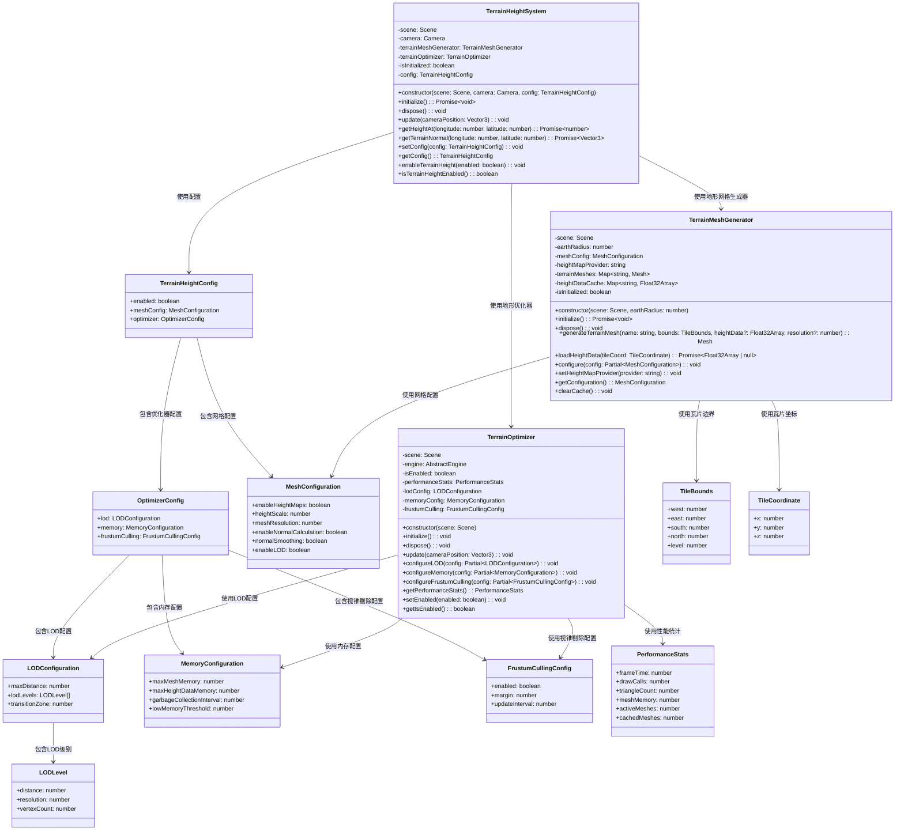
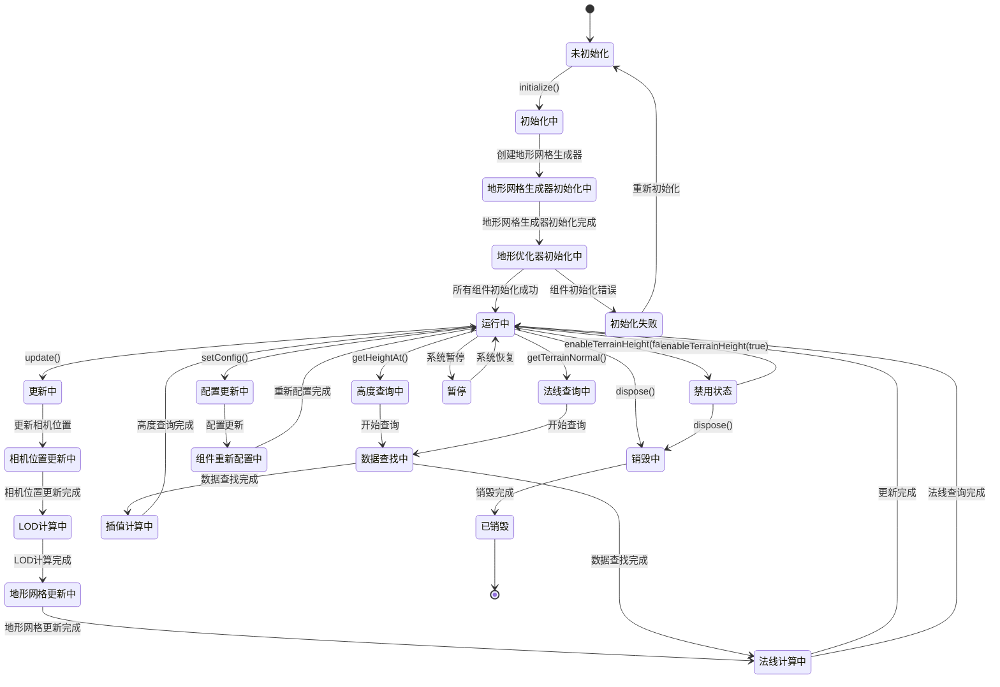
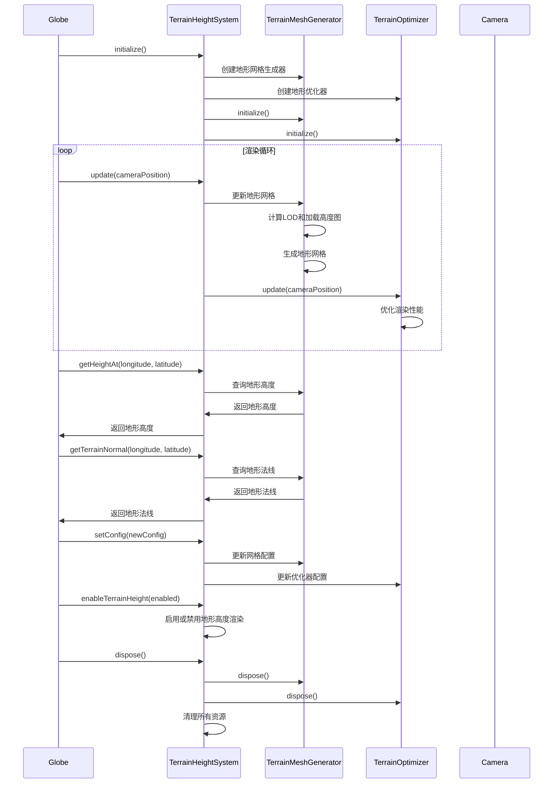

# 地形高度模块设计

## 模块概述

地形高度模块是 OpenEarth 系统的地形网格生成核心，负责基于高度图瓦片数据生成地球表面的3D地形网格。该模块专注于地形网格的生成和高度查询，不处理贴图相关的功能，为地球提供真实的地形起伏效果。

该模块采用基于 Babylon.js 的 Mesh 和 VertexData 架构设计，通过 TerrainMeshGenerator 实现地形网格生成的核心功能。高度图数据处理使用 terrain-rgb 格式，通过RGB值计算高程数据，支持全球范围的高精度地形数据。地形网格生成通过双线性插值将2D高程数据转换为3D顶点坐标，自动计算法线向量，生成适合GPU渲染的三角形网格。LOD管理基于距离和性能指标，根据相机距离动态调整地形网格精度，通过四叉树结构组织不同精度的地形块，实现平滑的细节级别切换。性能优化采用视锥剔除、遮挡剔除和批次渲染技术，只渲染可见的地形块，合并多个地形渲染调用减少绘制开销，使用GPU实例化技术提高大规模地形的渲染效率。

## 模块职责

- **高度图数据处理**：加载和处理terrain-rgb格式的高度图数据
- **地形网格生成**：基于高程数据生成3D地形网格
- **法线计算**：自动计算地形网格的法线向量
- **LOD管理**：实现多级细节的地形网格生成
- **高度查询**：提供任意位置的地形高度查询
- **性能优化**：优化地形网格生成和渲染性能

## 类图设计

## 状态图设计

## 时序图设计

## 核心算法设计

### 高度图数据处理算法

高度图数据处理算法处理terrain-rgb格式的高度图数据，将RGB值转换为高程数据。算法通过解析RGB通道值，使用terrain-rgb标准公式计算实际高程，支持全球范围的高精度地形数据。

### 地形网格生成算法

地形网格生成算法基于高程数据生成3D地形网格。算法将2D高程数据转换为3D顶点数据，计算法线和纹理坐标，生成适合渲染的三角形网格。算法支持不同分辨率的网格生成和自适应细分。

### 法线计算算法

法线计算算法为地形网格计算平滑的法线向量。算法通过分析相邻顶点的位置关系，使用叉积计算表面法线，支持法线平滑处理，确保地形表面的光照效果自然。

### 高度插值算法

高度插值算法计算任意位置的地形高度。算法使用双线性插值或三次样条插值，根据周围的高程数据点计算精确的高度值，支持平滑的高度查询。

### LOD管理算法

LOD管理算法根据相机距离动态调整地形网格精度。算法使用距离阈值和性能指标，自动选择合适的地形网格细节级别，在保持视觉效果的同时优化渲染性能。

## 配置参数

### TerrainHeightConfig

| 参数 | 类型 | 默认值 | 说明 |
|------|------|--------|------|
| enabled | boolean | true | 是否启用地形高度渲染 |
| meshConfig | MeshConfiguration | - | 网格配置 |
| optimizer | OptimizerConfig | - | 优化器配置 |

### MeshConfiguration

| 参数 | 类型 | 默认值 | 说明 |
|------|------|--------|------|
| enableHeightMaps | boolean | true | 是否启用高度图 |
| heightScale | number | 10000 | 高度缩放比例 |
| meshResolution | number | 64 | 网格分辨率 |
| enableNormalCalculation | boolean | true | 是否启用法线计算 |
| normalSmoothing | boolean | true | 是否启用法线平滑 |
| enableLOD | boolean | true | 是否启用LOD |

### LODConfiguration

| 参数 | 类型 | 默认值 | 说明 |
|------|------|--------|------|
| maxDistance | number | 50000 | 最大渲染距离 |
| lodLevels | LODLevel[] | - | LOD级别配置 |
| transitionZone | number | 0.2 | 过渡区域比例 |

### MemoryConfiguration

| 参数 | 类型 | 默认值 | 说明 |
|------|------|--------|------|
| maxMeshMemory | number | 268435456 | 最大网格内存（字节） |
| maxHeightDataMemory | number | 134217728 | 最大高度数据内存（字节） |
| garbageCollectionInterval | number | 5000 | 垃圾回收间隔（毫秒） |
| lowMemoryThreshold | number | 0.8 | 低内存阈值 |

## 性能优化

### 网格优化
- **LOD系统**：根据距离调整地形网格精度
- **视锥剔除**：只渲染相机视野内的地形
- **批次渲染**：合并多个地形渲染调用
- **实例化渲染**：使用GPU实例化技术

### 内存优化
- **网格简化**：减少不必要的顶点和三角形
- **顶点合并**：合并相似的顶点减少内存使用
- **索引优化**：优化三角形索引提高缓存效率
- **高度图压缩**：压缩高度图数据减少存储空间

### 数据优化
- **增量加载**：只加载可见区域的地形数据
- **数据压缩**：压缩高程数据减少存储空间
- **智能缓存**：缓存常用的地形数据
- **异步处理**：后台处理地形数据

### 计算优化
- **空间分割**：使用空间数据结构加速查询
- **预计算**：预计算常用的地形信息
- **近似算法**：使用近似算法简化复杂计算
- **多线程**：并行处理地形数据

## 错误处理

### 数据加载错误处理
- **高度图格式错误**：处理无效的高度图数据格式
- **数据完整性错误**：验证高度图数据的完整性
- **内存不足错误**：处理高度图数据加载内存不足
- **网络错误**：处理高度图数据网络加载失败

### 网格生成错误处理
- **网格生成错误**：处理地形网格生成异常
- **法线计算错误**：处理法线计算异常
- **顶点数据错误**：处理顶点数据异常
- **索引数据错误**：处理索引数据异常

### 计算错误处理
- **数值溢出错误**：处理地形计算中的数值溢出
- **除零错误**：处理除零运算的情况
- **精度损失错误**：处理浮点运算精度损失
- **参数验证错误**：验证地形计算参数的有效性

### 系统错误处理
- **初始化错误**：处理系统初始化异常
- **配置错误**：处理配置参数验证错误
- **内存管理错误**：处理内存管理异常
- **性能监控错误**：处理性能监控异常
