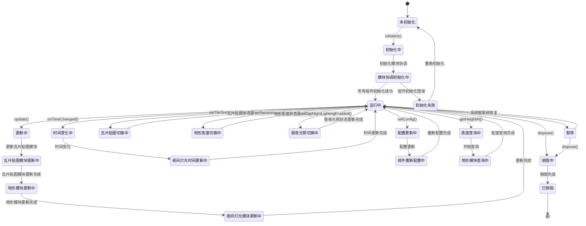

# 地球渲染模块设计

## 模块概述

地球渲染模块是 OpenEarth 系统的地球表面渲染协调器，负责整合瓦片贴图、地形高度和夜间灯光三个渲染效果。该模块作为渲染层的协调器，通过依赖注入的方式使用瓦片贴图模块、地形高度模块和夜间灯光模块，为地球提供完整的地表渲染效果。

该模块采用基于依赖注入的协调架构设计，通过 EarthRenderer 作为主控制器，协调三个子模块的工作流程。模块协调功能通过构造函数注入的方式获取瓦片贴图模块、地形高度模块和夜间灯光模块的实例，确保模块间的松耦合关系。渲染整合功能将三个渲染效果整合到最终的渲染结果中，根据功能开关状态决定是否应用瓦片贴图、地形高度和夜间灯光效果。功能控制提供三个功能的独立开关控制，用户可以根据需要开启或关闭瓦片贴图、地形高度或夜间灯光效果，实现灵活的地球渲染配置。时间同步通过订阅时间系统模块的时间变化事件，当接收到时间变化通知时自动更新太阳位置和光照效果，确保地球渲染与系统时间保持同步。统一接口为上层调用者提供简洁的API接口，隐藏底层模块的复杂性，提供一致的使用体验。

## 模块职责

- **模块协调**：整合瓦片贴图模块、地形高度模块和夜间灯光模块
- **渲染整合**：将三个渲染效果整合到最终结果
- **功能控制**：提供三个功能的独立开关控制
- **统一接口**：为上层调用者提供统一的API接口
- **时间同步**：响应时间变化，更新渲染效果

## 类图设计

## 状态图设计

## 时序图设计

## 核心算法设计

### 模块协调算法

模块协调算法负责整合三个子模块的工作流程。算法根据功能开关状态，协调瓦片贴图模块、地形高度模块和夜间灯光模块的更新顺序，确保三个效果能够正确叠加和显示。

### 渲染整合算法

渲染整合算法将三个渲染效果整合到最终的渲染结果中。算法根据功能开关状态，决定是否应用瓦片贴图、地形高度和夜间灯光效果，确保三个效果能够正确组合和显示。

### 功能控制算法

功能控制算法管理三个功能的启用和禁用状态。算法通过统一的接口控制各个子模块的启用状态，提供灵活的功能配置能力。

### 高度查询代理算法

高度查询代理算法将高度查询请求转发给地形高度模块。算法作为代理层，为上层调用者提供统一的高度查询接口，隐藏底层模块的复杂性。

## 配置参数

### EarthRendererConfig

| 参数                   | 类型    | 默认值 | 说明             |
| ---------------------- | ------- | ------ | ---------------- |
| enabled                | boolean | true   | 是否启用地球渲染 |
| enableTileTextures     | boolean | true   | 是否启用瓦片贴图 |
| enableTerrainHeight    | boolean | true   | 是否启用地形高度 |
| enableDayNightLighting | boolean | true   | 是否启用昼夜光照 |

## 性能优化

### 协调优化

- **依赖注入**：通过依赖注入减少模块耦合
- **事件驱动**：使用事件机制减少轮询开销
- **状态缓存**：缓存模块状态减少重复计算
- **异步处理**：异步处理非关键路径操作

### 接口优化

- **统一接口**：提供统一的API接口减少调用复杂度
- **代理模式**：使用代理模式隐藏底层复杂性
- **批量操作**：支持批量配置更新减少调用次数
- **状态同步**：优化模块间状态同步机制

### 内存优化

- **轻量级协调器**：协调器本身不占用大量内存
- **引用传递**：通过引用传递避免数据复制
- **状态管理**：高效的状态管理减少内存占用
- **资源复用**：复用子模块的资源减少重复分配

## 错误处理

### 模块协调错误处理

- **依赖模块错误**：处理瓦片贴图模块、地形高度模块和夜间灯光模块的错误
- **初始化错误**：处理模块初始化异常
- **状态同步错误**：处理模块间状态同步异常
- **配置错误**：处理配置参数验证错误

### 接口错误处理

- **参数验证错误**：处理API参数验证错误
- **调用异常错误**：处理子模块调用异常
- **状态不一致错误**：处理模块状态不一致异常
- **超时错误**：处理模块调用超时异常

### 系统错误处理

- **内存管理错误**：处理内存管理异常
- **性能监控错误**：处理性能监控异常
- **时间同步错误**：处理时间系统同步异常
- **渲染状态错误**：处理渲染状态异常
