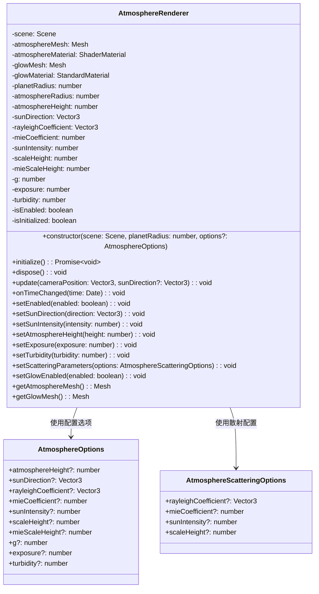
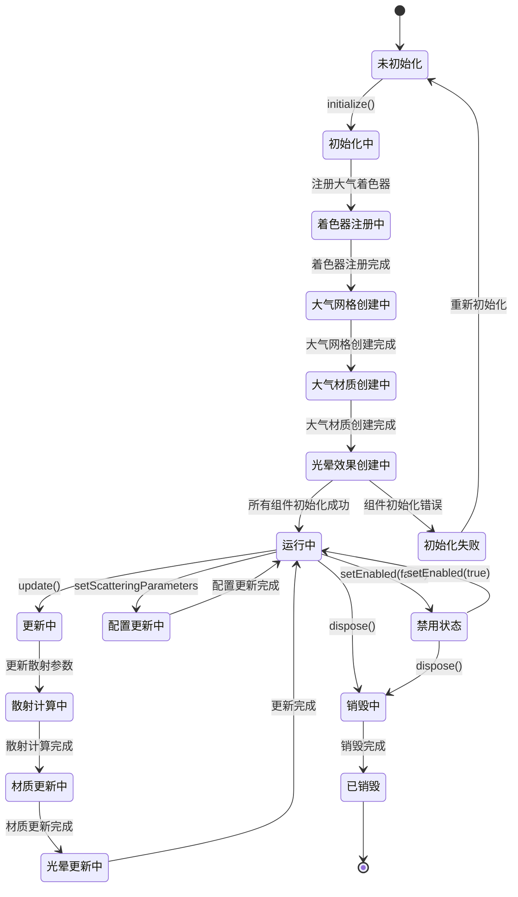
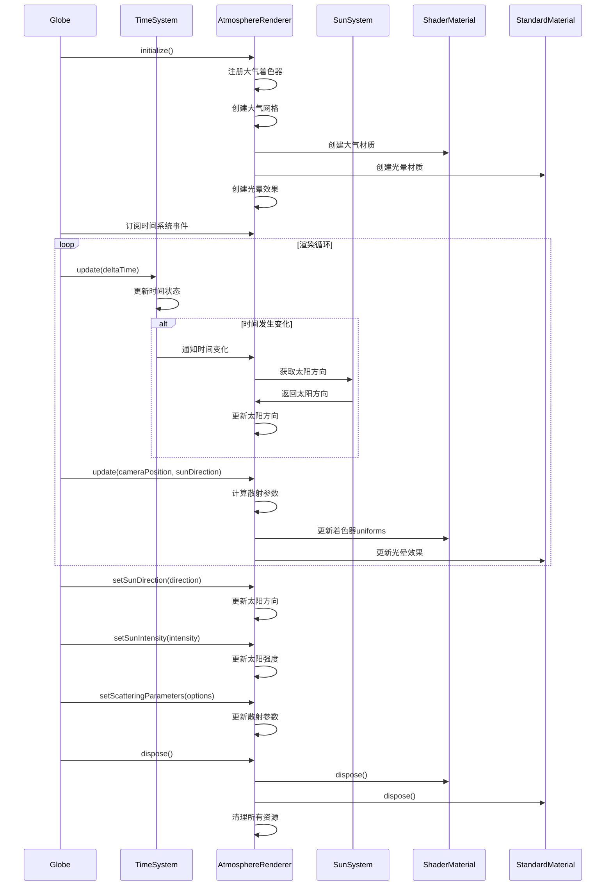

# 大气渲染模块设计

## 模块概述

大气渲染模块是 OpenEarth 系统的核心视觉效果组件，负责渲染地球的大气层效果。该模块基于物理的大气散射算法，实现瑞利散射和米散射，为从太空视角观察地球提供真实的大气层外观，包括大气光晕和散射效果。

该模块采用基于 Babylon.js 的 ShaderMaterial 架构设计，通过自定义 GLSL 着色器实现大气散射的物理计算。瑞利散射处理短波长光线的散射，产生蓝色大气效果，通过波长相关的散射系数和高度衰减函数计算散射强度。米散射处理长波长光线的散射，产生大气光晕效果，使用 Henyey-Greenstein 相位函数计算散射方向性。大气球体渲染使用球面几何，通过顶点着色器计算世界坐标和法线，片段着色器应用大气散射效果。大气光晕使用简单的标准材质实现，提供蓝色的大气光晕效果。时间同步通过订阅时间系统模块的时间变化事件，当接收到时间变化通知时自动更新太阳方向，确保大气渲染与系统时间保持同步。性能优化采用简单的球体几何和着色器渲染，通过 GPU 着色器实现高效的实时渲染。

## 模块职责

- **大气散射计算**：实现瑞利散射和米散射的物理计算
- **大气球体渲染**：渲染地球周围的大气球体效果
- **大气光晕**：渲染大气层的光晕效果
- **时间同步**：响应时间变化，更新大气效果

## 类图设计

## 状态图设计

## 时序图设计

## 核心算法设计

### 大气散射算法

大气散射算法基于物理的大气散射理论，实现瑞利散射和米散射的计算。瑞利散射处理短波长光线的散射，产生蓝色大气效果；米散射处理长波长光线的散射，产生大气光晕效果。算法通过积分计算光线在大气层中的散射路径。

### 瑞利散射计算算法

瑞利散射计算算法处理短波长光线的散射，产生蓝色大气效果。算法使用瑞利相位函数计算散射方向性，通过波长相关的散射系数和高度衰减函数计算散射强度。

### 米散射计算算法

米散射计算算法处理长波长光线的散射，产生大气光晕效果。算法使用 Henyey-Greenstein 相位函数计算散射方向性，通过不对称参数控制散射的方向性。

### 大气光晕算法

大气光晕算法实现简单的大气光晕效果。算法根据太阳角度调整光晕强度，使用蓝色调模拟大气层的光晕效果。

## 着色器设计

### 顶点着色器

顶点着色器计算世界坐标、法线、视角方向和高度等参数，为片段着色器提供必要的数据。着色器接收位置和法线属性，以及世界变换矩阵、相机位置、地球半径等uniform变量。主要计算包括世界坐标变换、法线变换、视角方向计算和高度计算，为片段着色器提供渲染所需的所有插值数据。

### 片段着色器

片段着色器实现大气散射的最终渲染效果，包括瑞利散射、米散射、光学深度计算和色调映射。着色器接收太阳方向、相机位置、散射系数、太阳强度、尺度高度等uniform变量。主要处理包括光学深度计算、散射计算、透射率计算、内散射计算、日落颜色和大气光晕，最终输出带有正确透明度的大气颜色。

## 配置参数

### AtmosphereOptions

| 参数                | 类型    | 默认值                   | 说明                 |
| ------------------- | ------- | ------------------------ | -------------------- |
| atmosphereHeight    | number  | 100000                   | 大气层高度（米）     |
| sunDirection        | Vector3 | (1, 0.5, 0.3)            | 太阳方向向量         |
| rayleighCoefficient | Vector3 | (0.0058, 0.0135, 0.0331) | 瑞利散射系数         |
| mieCoefficient      | number  | 0.0021                   | 米散射系数           |
| sunIntensity        | number  | 22.0                     | 太阳强度             |
| scaleHeight         | number  | 8500                     | 瑞利尺度高度（米）   |
| mieScaleHeight      | number  | 1200                     | 米尺度高度（米）     |
| g                   | number  | -0.758                   | 米相位函数不对称参数 |
| exposure            | number  | 2.0                      | HDR曝光控制          |
| turbidity           | number  | 2.0                      | 大气浑浊度           |

### AtmosphereScatteringOptions

| 参数                | 类型    | 默认值 | 说明         |
| ------------------- | ------- | ------ | ------------ |
| rayleighCoefficient | Vector3 | -      | 瑞利散射系数 |
| mieCoefficient      | number  | -      | 米散射系数   |
| sunIntensity        | number  | -      | 太阳强度     |
| scaleHeight         | number  | -      | 大气尺度高度 |

## 性能优化

### 渲染优化

- **简单几何体**：使用球体几何实现大气效果
- **GPU着色器**：所有计算在GPU中完成，无需CPU处理
- **最小绘制调用**：单个网格和材质实现完整效果

### 计算优化

- **预计算参数**：预计算常用的散射参数
- **近似算法**：使用近似算法简化复杂的散射计算
- **优化采样**：使用优化的采样技术平衡质量和性能

## 错误处理

### 着色器错误处理

- **着色器编译失败**：提供错误日志和降级方案
- **uniform参数错误**：验证着色器参数的有效性
- **渲染状态异常**：处理渲染状态异常情况

### 材质错误处理

- **材质创建失败**：处理材质创建异常
- **纹理加载失败**：处理纹理加载异常
- **参数验证**：验证材质参数的有效性
