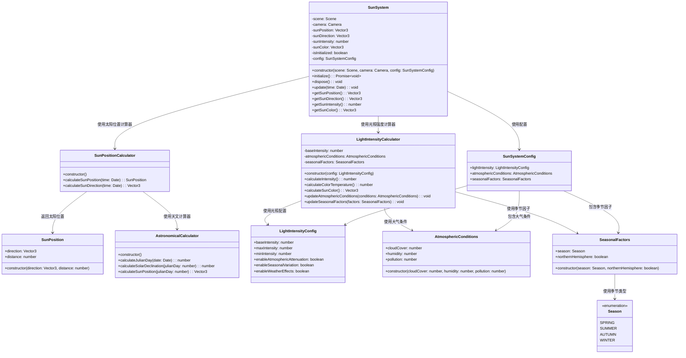
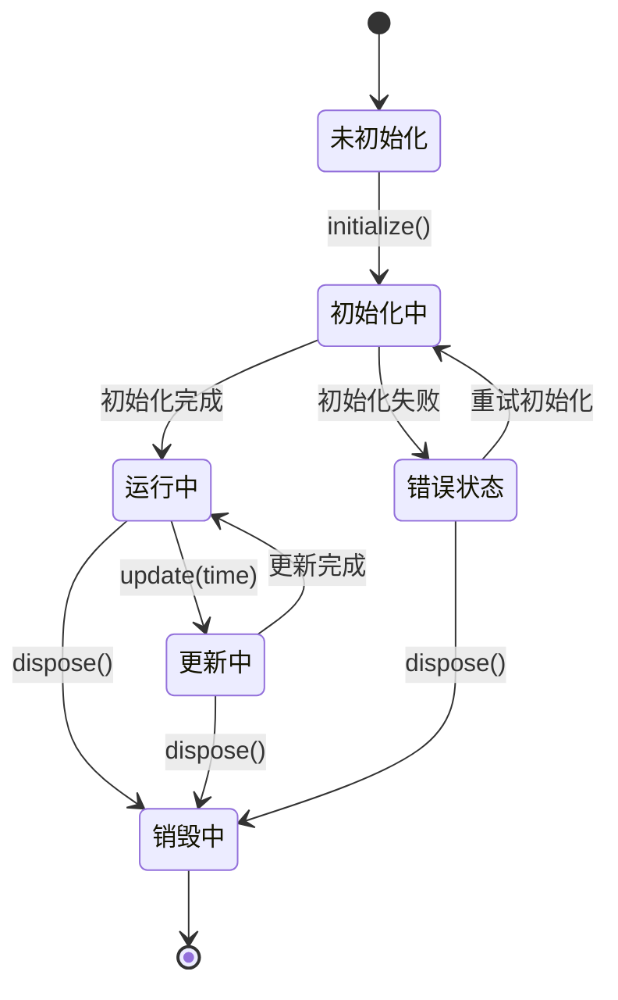
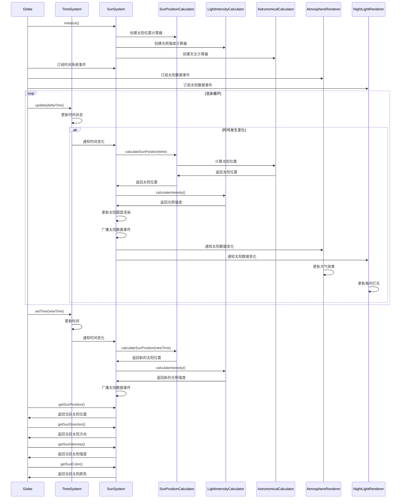

# 太阳系统模块设计

## 模块概述

太阳系统模块是 OpenEarth 系统的光照计算核心，负责计算太阳位置和光照强度。该模块基于天文算法实现精确的太阳位置计算，为大气渲染、夜间灯光和地球表面光照提供准确的光照数据，支持动态光照效果。

该模块采用基于儒略日计算的天文算法，通过计算太阳相对于地球的精确位置，为从太空视角观察地球提供准确的光照数据。太阳位置计算使用 Meeus 天文算法，考虑地球公转轨道、黄赤交角和岁差等天文现象，通过数值积分和近似公式计算太阳在宇宙空间中的实时位置。光照强度计算基于太阳常数，使用固定的太阳光照强度，考虑地球大气层的衰减效应和季节变化因素。太阳圆盘渲染采用公告板技术，通过四边形几何和透明度混合实现太阳的视觉效果，使用固定的太阳圆盘大小和亮度。时间同步通过订阅时间系统模块的时间变化事件，当接收到时间变化通知时自动更新太阳位置，确保太阳位置与系统时间保持同步。事件通知采用 Babylon.js 的 Observable 系统，向大气渲染和夜间灯光等模块提供太阳位置和光照数据，实现模块间的松耦合通信。性能优化采用预计算和缓存技术，缓存常用的天文计算结果，使用近似算法简化复杂的天文计算，通过增量更新减少计算开销。

## 模块职责

- **太阳位置计算**：基于天文算法计算太阳相对于地球的精确位置和方向
- **光照强度计算**：计算太阳光照强度和颜色温度
- **太阳圆盘渲染**：渲染太阳的视觉效果，包括大小、亮度和光晕
- **光照数据提供**：为其他模块提供光照方向和强度数据
- **天文事件计算**：计算太阳与地球的相对位置变化

## 类图设计

## 状态图设计

## 时序图设计

## 配置参数

### SunSystemConfig

| 参数                  | 类型                  | 默认值   | 说明         |
| --------------------- | --------------------- | -------- | ------------ |
| lightIntensity        | LightIntensityConfig  | 默认配置 | 光照强度配置 |
| atmosphericConditions | AtmosphericConditions | 默认条件 | 大气条件     |
| seasonalFactors       | SeasonalFactors       | 默认因子 | 季节因子     |

### LightIntensityConfig

| 参数                         | 类型    | 默认值 | 说明         |
| ---------------------------- | ------- | ------ | ------------ |
| baseIntensity                | number  | 1.0    | 基础光照强度 |
| maxIntensity                 | number  | 1.2    | 最大光照强度 |
| minIntensity                 | number  | 0.8    | 最小光照强度 |
| enableAtmosphericAttenuation | boolean | true   | 启用大气衰减 |
| enableSeasonalVariation      | boolean | true   | 启用季节变化 |
| enableWeatherEffects         | boolean | false  | 启用天气效果 |

### AtmosphericConditions

| 参数       | 类型   | 默认值 | 说明             |
| ---------- | ------ | ------ | ---------------- |
| cloudCover | number | 0.0    | 云层覆盖度 (0-1) |
| humidity   | number | 0.5    | 湿度 (0-1)       |
| pollution  | number | 0.0    | 污染程度 (0-1)   |

### SeasonalFactors

| 参数               | 类型    | 默认值 | 说明       |
| ------------------ | ------- | ------ | ---------- |
| season             | Season  | SPRING | 季节       |
| northernHemisphere | boolean | true   | 是否北半球 |

## 性能优化

### 预计算缓存

- 缓存常用的天文计算结果
- 使用查找表加速复杂计算

### 近似算法

- 使用简化的天文计算模型
- 在精度和性能之间平衡

### 增量更新

- 只在时间变化时重新计算
- 减少不必要的计算开销

## 错误处理

### 天文计算异常

- 处理无效的日期输入
- 提供天文计算的错误恢复

### 光照计算异常

- 验证光照参数的有效性
- 处理极端光照条件

### 渲染异常

- 处理太阳圆盘渲染错误
- 提供降级渲染方案
